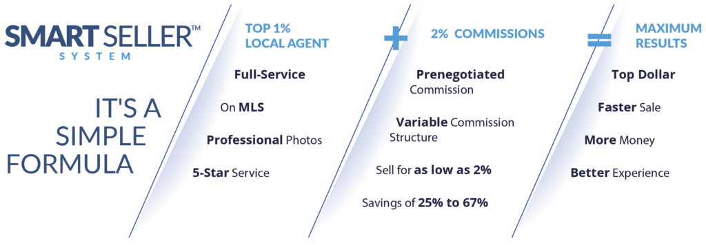

If the answer to that question is yes, you aren’t alone, and most importantly, you’ve come to the right place! Many of us have been through it before, and can say with absolute certainty that there comes a time in every homeowner’s life when they start asking themselves that very important question: “is the time right to sell my home?” So, let’s get to the facts, if we are looking at the most recent market analysis released by the HUD the answer would be a resounding, YES! The latest National Housing Market Indicators reported that [sales of existing homes have actually increased](https://www.huduser.gov/portal/sites/default/files/pdf/Housing-Market-Indicators-Report-July-2021.pdf). In fact, a [recent article by Forbes](https://www.forbes.com/advisor/mortgages/how-to-get-the-most-when-selling-in-todays-hot-real-estate-market/) explains that “Home sellers have a royal flush in today’s housing marketing. Inventory is low, home prices are rising, and buyer appetite is ravenous.” Need we say more? It’s without a doubt that many homeowners across the United States are taking advantage of the current market to part ways with a property that they have outgrown in one way or another. With that said, we also understand that it comes down to more than just what your neighbors are doing! 

There are many aspects of a home selling process that need to be considered before you are ready to say, “I’m ready to sell my home!” You might be asking yourself what factors other sellers consider before they are ready to take the leap, so we figured we’d cover some of the most common concerns and just how we can help ease those woes! 

Most commonly, sellers become worried that they aren’t fully equipped with the right resources to sell their home themselves or that they wouldn’t get top dollar for their property. These are valid concerns and not having a trusted and top-performing helping hand in the process can seem both daunting and oftentimes, fruitless. In fact, [Forbes also says](https://www.forbes.com/advisor/mortgages/how-to-get-the-most-when-selling-in-todays-hot-real-estate-market/) “Sellers should keep a cool head when it comes to pricing their home…work with your agent to come up with a strong opening price and let the market factors (low inventory, high demand) do the rest.” 

So, who exactly is that agent that will help you get top dollar at the closing table? In our opinion, it is an **[IDEAL AGENT®](https://idealagent.com/)**! 

**Who We Are**

We can all agree that the best agents get the best results and when those agents do it for less, our clients win. **[IDEAL AGENT®](https://idealagent.com/)** was designed to make the home selling process easy! We created **IDEAL AGENT®** and the **SMART SELLER™ System** to provide our clients with a better home selling experience, at a fair commission, that gets them to the closing table maximizing their profits. In fact, we've helped thousands of home sellers get top dollar for their homes and save big on real estate commissions with our [**SMART SELLER™ System**](https://idealagent.com/). 

It’s often misunderstood by sellers that increased profits are solely impacted by a lower commission. This is most certainly NOT the case! In fact, large marketing budgets and years of experience in their markets allow our agents to understand what it takes to provide maximum visibility to their client’s listings. More eyes on the seller’s property will undoubtedly provide the best chance of reaching the ideal buyer willing to pay top dollar. 

More of a visual person? This may help:

**How Does [IDEAL AGENT®](https://idealagent.com/) Select the Agent That Will Help Me Sell My Home?** 

For starters, it’s important to understand how we select all of the agent partners in our network. Our internal team of expert recruiters interview and handpick only the best agents in local markets across all 50 states, the US Virgin Islands, and Puerto Rico. We’re extremely selective and turn down over 90% of the agents who want to work with us, as only the top 1% are able to join our program. Importantly, agents can’t pay to join, they are only invited to be a part of our network after they’ve been vetted by our team. Simply put, you can rest assured that we interviewed the best agents in your local market and negotiated a great commission on your behalf. These agents rank in the **top 1% local and nationally** and are highly experienced professionals.

So, how exactly do we pair you with your specific agent? Simple! Once you reach out to us, a member of our Client Concierge team will connect with you to learn everything that we need to know to make the ideal match. We’ll discuss your goals and needs to match you with the perfect agent who has experience selling similar homes at the same price point in your marketplace. Not only will you be paired with a top agent, but you will have a member of our Client Concierge team available to you to answer any questions you may have!  

**Is this the Best Home Selling Strategy to Sell My Home?** 

Absolutely! Our home selling strategy attains the best results for selling in the shortest amount of time, for top dollar, while putting more money in your pocket at the closing table! In addition to being on the Multiple Listing Service and cooperating with all Realtors®, your home will be expertly showcased with professional photos on major real estate websites such as Zillow, Redfin, Trulia, Yahoo Homes, MSN and more. Remember, these are not discount agents, they are the best in the market and typically charge 6% or more. We have negotiated a great commission for you, saving you thousands of dollars while getting the best results.

Our top agents utilize technology to bring efficiency and cost savings to the real estate transaction. They have agreed to pass that savings onto you since we are sending these agents a steady stream of eager clients like yourself. If you are wondering if you will receive the same 5-star level service as a client that they receive on their own who has to pay 6%or more in commission, the answer is yes! You will most certainly receive the same 5-star level service as if you were paying 6% or more. These are full-service agents that represent top local and national brokerages. Your home will be on the MLS and all major real estate sites. They have the experience and marketing knowledge to sell your home fast and for top dollar.

**Here are some agent quick facts:**

- They have all been vetted and are considered the **top 1% of agents** in their respective areas.
- They’re committed professionals at the top of their game who take the time to listen and understand your needs. They’re not people who do real estate part-time or as a hobby.
- They have proven results and understand the industry. You can count on our agents to guide you through the entire buying or selling process even during the unexpected.
- All of our agents come from major and local brokerages. Our typical agent has 14+ years of experience, closes 100-300 transactions a year, and has a five-star rating.
- They work with large budget marketing teams and have the resources to get your home out to the right buyer. This includes engaging social media marketing for your listing, as well as professional home photography.
- Our agents will prepare a Comparative Market Analysis before listing your home.
- They will place your listing on the Multiple Listing Service and other major real estate sites like Zillow, Realtor.com, etc.
- Several of our agents manage or are part of teams that include buyer’s agents and transaction coordinators which help open your pool of potential buyers.

**Do You Offer Full-Service Representation to Sell My Home?**

Absolutely, our variable commission does not come with a drop in the level of top-notch service. Our sellers experience full-service representation at every step of the home selling process that maximizes their profits while saving on commission. Does it really get any better than that?

**Here is what you can expect when you work with our agent partners to sell your home:**

**_An extensive home walk-through:_** Our agents will review your home’s best features and provide tips to maximize the ultimate selling price. 

**_Prepare a Comparative Market Analysis:_** If you aren’t familiar with a CMA, you’ll definitely want to learn more. According to [Forbes](https://www.forbes.com/sites/taramastroeni/2019/12/19/what-is-a-comparative-market-analysis-and-how-you-can-use-one-to-help-sell-your-home/?sh=3ecaea5a118f), **“**A CMA helps sell properties by providing guidance for the list price. Truth be told, choosing the correct list price is one of the best things that sellers can do to attract interested buyers.” Your agent will prepare a CMA showing recent and comparable home sales in your neighborhood so you can get a good understanding of your ultimate listing price to have your home sold for maximum profit! 

**_Take Professional Photography:_** From utilizing a drone to get the best views of your home, to simply having the right photos taken, our agents are able to produce the best quality images that will undoubtedly increase interest in your listing. Photography services like Matterport 3D & Floorplan, video, and aerial photography may also be available. 

**_Maximum Marketing Exposure:_** Your listing will be posted on the Multiple Listing Service (MLS), popular real estate websites like Zillow, Reltor.com, etc., and promoted on social media channels to get maximum exposure! 

**_Professional Teams:_** There is a great benefit to having an agent that is part of a professional team, one of those is a built-in buyer’s base of clients due to their relationships with buyer’s agents. 

**_Yield Offers and Negotiations:_** Our agents will negotiate the best offer on your behalf as well as work with inexperienced buyer’s agents. You can rest assured that they will be right by your side through the entire process. 

**_Facilitate Inspections & Coordinate Closing:_** You can expect your agent to coordinate all inspections and walkthroughs as well as navigate bad home inspections and low appraisals. They will also coordinate and communicate with the closing attorney/title escrow office and ultimately coordinate the final steps of the transaction to a successful closing!

It's important to note that we created **[IDEAL AGENT®](https://idealagent.com/)** to provide a better home selling experience. We understood that it can be tasking to sell your home while maximizing your profits, we wanted to create a seamless experience you’ll never forget! Also, you may have thought to call us to save money, but the real value is in the results you achieve with our top-performing local real estate agents. Instead of competing with real estate agents, **[IDEAL AGENT®](https://idealagent.com/)** works with agents across all brands to increase their current business. It’s a win-win for consumers and real estate agents!

**Is There a Cost to Sell My Home with [IDEAL AGENT®](https://idealagent.com/)?**

No! Our service is **FREE** and there is **ZERO** obligation. Our team is here to make the home selling process easy, not bog you down with additional costs and fees. 

**How Can I Get Started and Sell My Home?** 

Here’s how our process works: first you will connect with one of our Client Concierge team members by [calling or chatting](https://idealagent.com/) with us. Initially, you’ll be asked to tell us about your home selling goals and where you are located. We have agents in all 50 states, so we want to be sure we connect you with the closest and best agent for you. Next, you’ll be asked to answer a few additional questions about your selling needs, again, this will help us match you with the most qualified agent for your specific listing. After we’ve gathered all of the necessary information, we will have your Ideal Agent contact you when you are ready! If you are ready right away, just let your Client Concierge know and you can expect a call from your top-rated local agent to set up a listing appointment! It is as easy as that! 

Are you feeling ready to join the thousands of happy clients who sold their homes for a great commission while maximizing their profits! [Reach out](https://signup.idealagent.com/) to our team now! We can’t wait to learn more about your property and match you with your **IDEAL AGENT®**. Don't forget to read our article "[IDEAL AGENT®, Recent Home Sales, & The Reviews that Say it All](https://blog.idealagent.com/things-to-consider-before-selling-your-home/)" to hear directly from our happy home sellers!
