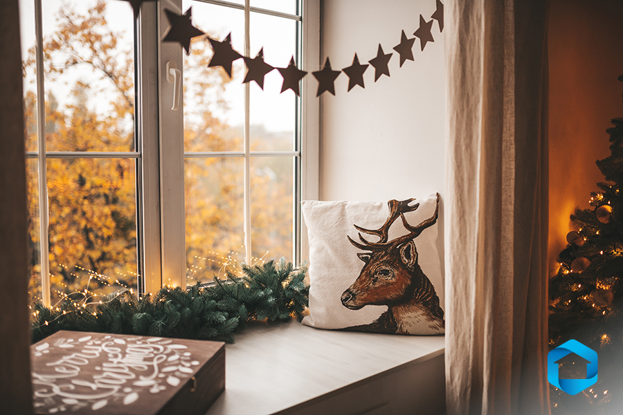
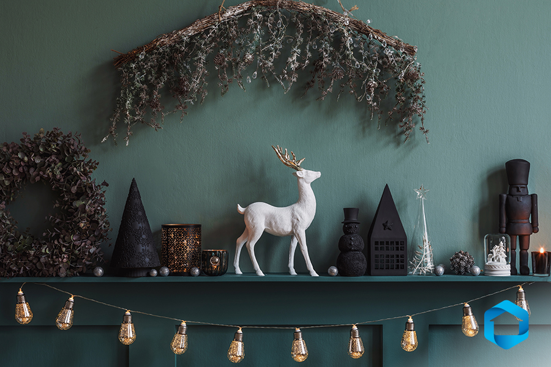
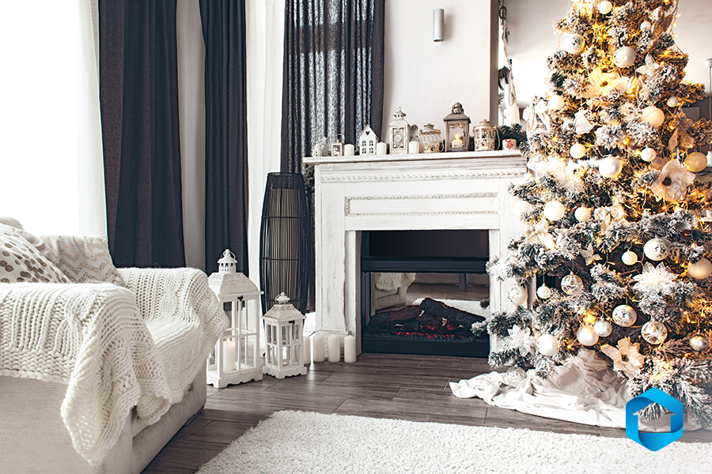

Are you getting ready to deck the halls? With the holiday season upon us, decorating your home seems like the perfect afternoon activity the whole family can get in on! From fresh garland on your mantle to a festive throw blanket, here are our top 5 holiday home decor tips that are sure to make any home a cozy winter wonderland!

### 1\. Choose a Color Palette

Are you opting for classic winter colors like red, wintergreen, white, hints of gold? Or are you thinking of introducing some cooler holiday tones like deep berry, gray, pine green, and bone? We suggest finding a color scheme that you can incorporate throughout your home to tie the holiday home décor together with style. In fact, some interior designers suggest taking that design element a step further! [Studio McGee](https://studio-mcgee.com/2019-11-13-how-to-style-holiday-greenery/) says, “Carrying your color palette into your gift-wrapping helps make your look feel cohesive.” [Forbes](https://www.forbes.com/advisor/home-improvement/holiday-kitchen-decorating-ideas/) agrees with them writing, “think cohesively, holiday kitchen decor works best when it makes the kitchen feel like an extension of the rest of the home rather than a completely separate space. This doesn’t mean everything has to be matchy-matchy from one room to the next; it just means it is best to avoid abrupt and seemingly nonsensical transitions from room to room (an example would be a whimsical kitchen next to a sophisticated dining room, in a home with a great room concept floor plan).”

###   
2\. **Light Up Your Space**

Is there anything cozier than a room in candlelight or delicate twinkling market lights? [Forbes](https://www.forbes.com/advisor/home-improvement/holiday-kitchen-decorating-ideas/) says, "You can never go wrong with lights. And we’re not talking about the chandeliers or track lighting that is there all year long—we’re talking about things like strands of white bulbs or assortments of dainty battery-operated candles, strategically placed in a way that makes a distinctive visual impact. When the sun goes down (so early this time of year), all you have to do is turn down the “regular” lights, turn on your holiday lights and you’ll see an instant transformation. When choosing holiday lights for your home stick with LEDs that say 'warm' or 'soft' on the box (in the 3,000 to 3,300 kelvin range). Lights in this color temperature range will provide a cozier ambiance.” Speaking of ambiance, you might want to consider stringing some lights in your patio to enjoy an evening hot chocolate with a holiday twinkle. As far as candles go, consider fresh pine scents, warm vanilla and spices, even a cinnamon apple or pumpkin scent would make any home smell like the holidays have arrived!

###   
3\. **Opt for Soft & Warm Elements**

Throw pillows and blankets make any space feel warm, especially during the holidays. [Studio McGee](https://studio-mcgee.com/the-sunday-7-we-wrote-a-book) says, “Nothing is more inviting than a cozy scent with a warm blanket draped over a couch. But also consider storing your throws in easy-to-reach solutions like a basket or folding your throws and placing them in any open storage nooks. It’s functional, it’s inviting, and the textiles add a little softness and warmth to the vignette. Incorporating pillows in your holiday palette can also tie in the room and bring in the holiday cheer.” Make sure to stay in your color scheme but alternate textures, maybe one pillow is fuzzy and the other is soft cotton. The cozy possibilities are endless!

###   
4\. **Bake-Up Some Holiday Home Décor**

Thinking about baking and decorating holiday cookies or cupcakes with the family? What about a gingerbread house? Those delicious baked goods might be just the ticket as far as festive décor goes. [Forbes](https://www.forbes.com/advisor/home-improvement/holiday-kitchen-decorating-ideas/) writes, “Holiday cookies are tasty, but many of them are also easy on the eyes. Rather than putting them in sealed storage containers, consider placing them on tiered trays or festive plates so they can double as décor (the only downside—having them right in front of you at all times could prove a little too tempting). Turn your dry baking ingredients into holiday decorations (yes, really). All it takes is a pretty wooden or glass container, an adhesive chalkboard sticker, a bow (bonus if it is red, green or silver) and some cinnamon sticks (flour, granulated sugar or chocolate chips will work, too) and you are all set. This is the perfect place to display your holiday plates, platters, bowls and glasses. Not only will it look festive, but it will also allow for easy access to these items when you want to use them. If you don’t have holiday tableware, no worries—you can display other holiday items (like framed photos or various knick-knacks) on your kitchen’s open shelves.” You could even opt for a holiday coffee nook with seasonal mugs on display, or a hot cocoa bar to give your kitchen the festive flair you are looking for while making it easier for you and your loved ones to have everything you need for your warm holiday drinks.

### 5\. **Add Fresh Greens and Sparkle**

From stringing fresh garland over your mantle or through your staircases to a fresh pine wreath on your door, bringing the outdoors in can create a sense of festive cozy. Want to add some sparkle? Consider stringing ornaments through your garland or adding ornaments to a bowl as a centerpiece! If you celebrate with a Christmas tree, choosing ornaments that compliment your color scheme is also a great idea. [Studio McGee](https://studio-mcgee.com/the-sunday-7-we-wrote-a-book) had a great way of thinking about tree decorating, “We love thinking about this in four parts — the top, the bottom, the ornaments, and the decorative garland. Our biggest tip is to look for ornaments with different scales, shapes, and textures but tie it together with a unifying color palette.”

Ready to get working on your holiday home décor? We hope these tips and tricks help you make your space even more special during the holiday season. From creating memories with loved ones to enjoying the peace of a lovely warm home during the cold months, we can’t wait for you to decorate your cozy holiday space!
