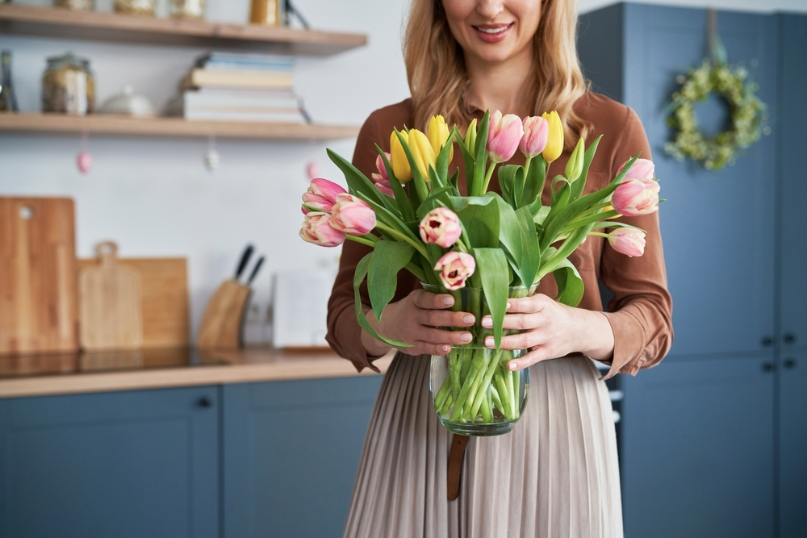
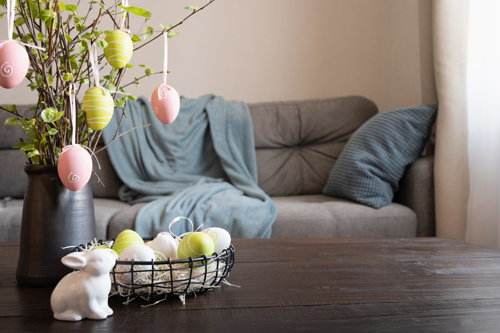
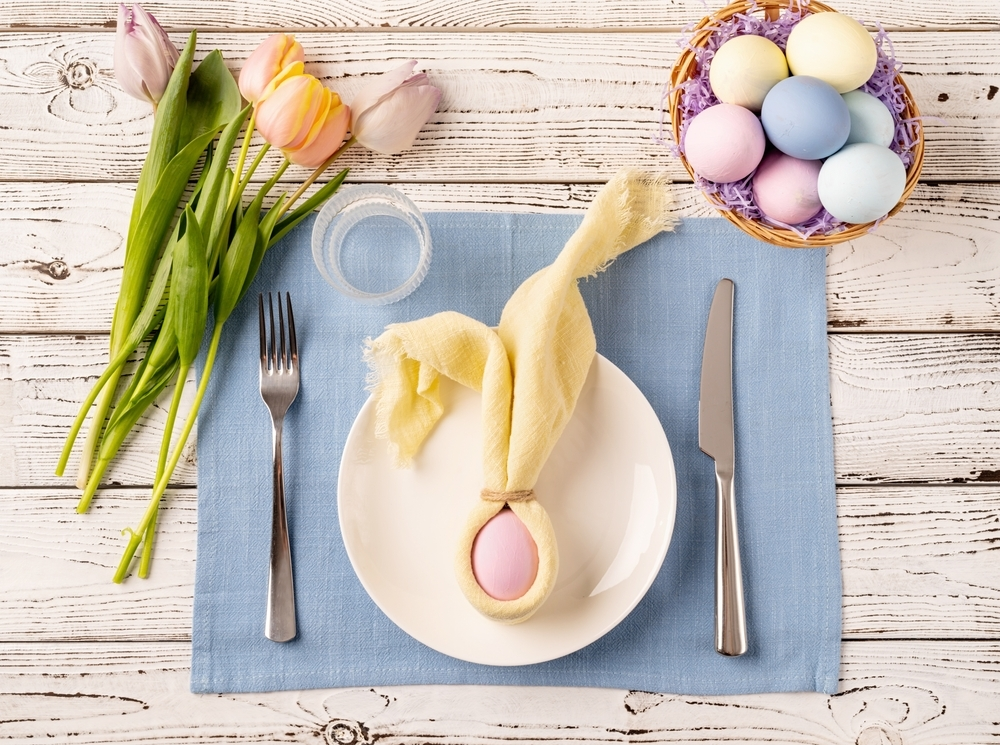

Thinking of having your friends and family over for an Easter Sunday meal? Tastefully decorating your space for a
spring-themed event is just the ticket, and that certainly includes an easter egg hunt! From festive garland to fresh
floral blooms, here are a few decorating tips to consider:

**Fresh Flowers**  
Bring the garden home with you by placing a fresh bouquet of blooms at the center of your table. Daisies, hydrangeas,
tulips, orchids, daffodils, and gardenias are especially popular for the season. Don’t forget, Spring is meant for
flowers rich in color think yellow, purple, pink, bright red, and orange. Another way to enhance your Easter décor is
placing fresh flowers by your front door to catch the eye of guests right as they walk in.

**Easter Tree Decorating Traditions**  
Easter décor takes on a whole new meaning when you think about Osterierbaum, better known as an Easter decorated
tree. [Martha Stewart](https://www.marthastewart.com/274530/decorating-for-easter?slide=6b2478d2-b543-4189-9ec8-ee5a3fcc2db0#6b2478d2-b543-4189-9ec8-ee5a3fcc2db0)
says “Take guests on a journey to Germany and Austria when they step inside your abode by incorporating traditions from
afar, like the Ostereierbaum, which is described as a colorful Easter egg tree. Christmas is not the only holiday to
have a dedicated plant—display blown and decorated eggs from the bare branches for a striking look. From garlands to
baskets, bouquets to decorative eggs.”

Egg-Cellent Ways to Decorate with Eggs  
Have you ever thought of an egg
garland? [Good House Keeping](https://www.goodhousekeeping.com/holidays/easter-ideas/g2217/easter-decorations/?slide=18)
suggests an “eggshell garland” writing, “Easter eggs have limitless decorating opportunities. To make an adorable
garland, hot-glue ribbon around the outside of clean shells with the tops cracked off. Then place a wet piece of floral
foam inside each and push in a few short stems. Hang a handful along a string in front of a blank wall or window.” This
might even be a great way to set up an Easter photo wall to take pictures with your guests. Have a bowl of photo props
like bunny ears, sunflower sunglasses, etc. to give your photo wall some personality. What about wrapping dyed eggs in
ribbon and using them as a centerpiece or coffee table décor? The possibilities are endless!

Place Settings  
It doesn’t get more festive than a well-designed place setting! After choosing your color pallet and setting out your
fresh flowers, you can make adorable place settings by wrapping a small egg with your napkin and tying it right at the
top to look like a bunny or even a “bunny tail place
settings” [Good House Keeping](https://www.goodhousekeeping.com/holidays/easter-ideas/g2217/easter-decorations/?slide=18)
writes, “Make a cardstock circle for each guest and write their name in bold, black letters. Glue on a pom-pom bunny
tail and crisscross two faux flowers to create cute bunny ears.” Get creative, your guests will love this!

Easter Baskets  
Who says Easter baskets are just for the kids? Putting together curated baskets for your friends and family can be both
a lovely gift and added Easter décor. Consider lining up your baskets by an empty wall or perhaps under an eggshell
garland! If you’re hosting brunch at home, you can hand your guests their take-home basket as they head out. When it
comes to assembling each of your baskets, make sure you purchase easter grass for the bottom of the basket, as well as
plastic eggs and your favorite candy to fill each of them. As for the add-ons, you can include several things like a
spring-scented candle, bath soap or bath bombs, assorted nuts, local honey, green or floral tea satchels, etc.

We hope you enjoy the holiday with those you love and have a great time arranging your home to feel egg-stra special!
