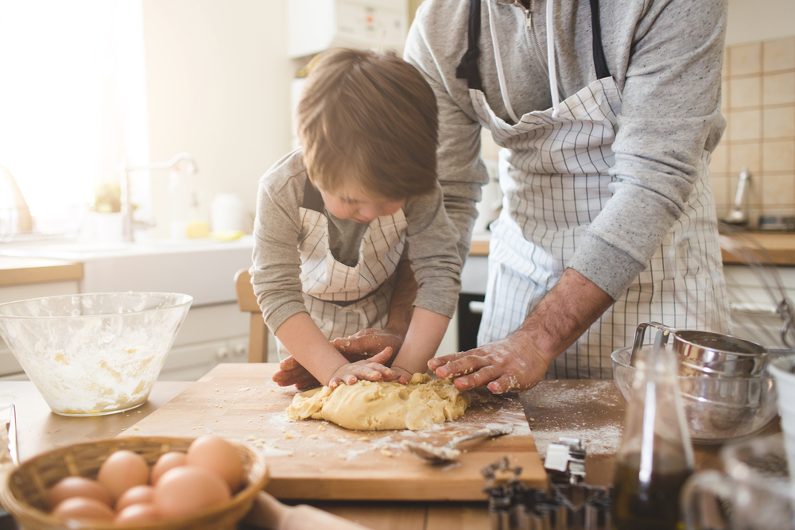
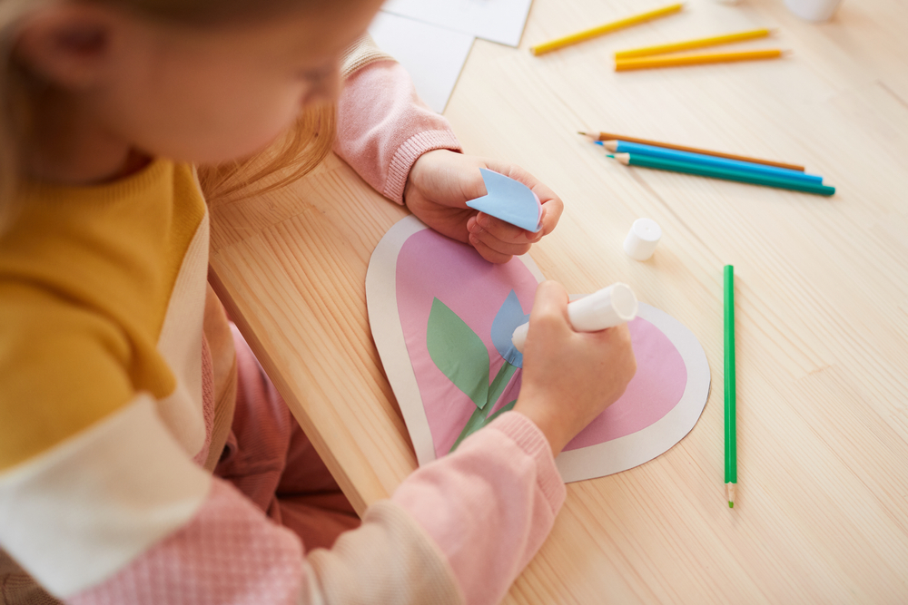

Moms make every day great, so why not make this Mother’s Day extra sweet with some kid-friendly treats and crafts to spoil mom on her special day! Here are some ideas you don’t want to miss:

**Fresh Flowers**  
From red roses to yellow tulips, surprising mom with beautiful blooms is always a wonderful idea. In fact, [NY Magazine](https://nymag.com/strategist/article/best-mothers-day-flowers.html) suggested some of the most unique arrangements of the year like the gorgeous “[BloomNation Isabelle](https://www.bloomnation.com/florist/le-jardin-rose/isabelle/)” and the ever-popular “[Venus Et Fleur Round Eternity Roses](https://www.venusetfleur.com/products?box=9fe3acb0-4edc-11e8-96d0-410fee4c7cda&box_variant=61f2b990-b71a-11e8-aae0-b18974f92a99&flower_one=54186b40-cf5f-11e9-bc20-81010a8f977e&flower_two=f963c670-cf5b-11e9-bc20-81010a8f977e&stencil=5415cb60-b719-11e8-aae0-b18974f92a99#/steps/arrangement/colors)” that come neatly arranged in a stunning box and stay fresh for up to a year. If you’d rather pick up something local, you can run to a grocery store, neighborhood florist, or even head to a farm that offers fresh flower picking options for sunflowers, wildflowers, etc. **Tip:** If you purchase flowers from a grocery store the night before, you can cut the stems and put them in a decorative vase. Come morning, arrange them on a breakfast tray with a warm coffee or tea and breakfast item to surprise mom with breakfast in bed!   

**Homemade Cookies**   
You can’t get flowers without a sweet treat to go with them! Gather the kids in the kitchen and bake some kid-friendly and delicious cookies for mom. If you aren’t sure what to bake, you’d be surprised to learn that there are quite a few easy and kid-approved recipes to choose from. [Southern Living](https://www.southernliving.com/food/kitchen-assistant/cookie-recipes-for-kids) has tons of 5-star rated and simple cookie recipes like “[Brown Butter Chocolate Chip Cookies](https://www.southernliving.com/recipes/brown-butter-chocolate-chip-cookies)” and “[Peanut Butter Kiss Cookies](https://www.southernliving.com/recipes/peanut-butter-kiss-cookies).” If you wanted to bake something a little more unique, [PureWow](https://www.purewow.com/food/easy-cookie-recipes-for-kids) has some delicious, impressive, and kid-friendly cookie suggestions that stand out like the beautiful “[Heart Thumbprint Cookies](https://www.purewow.com/recipes/heart-thumbprint-cookies)” and the standout “[Lucky Charms Snickerdoodles](https://iamafoodblog.com/snickerdoodle-lucky-charms-cookies/).” You might even start a Mother’s Day tradition that is passed down through the years and generations!   

**Art & Crafts Cards**  
There is nothing sweeter than a handmade card on Mother’s Day. Get some craft paper, markers, colored pencils, glue sticks, etc., and let the kids get creative! If your kids are old enough, they can write a special message on the card themselves, otherwise, help them write a sweet note or poem. If you have time, consider crafting a few cards for all of the special moms in your life! We can guarantee that every mom will love this!  

**A Relaxing Moving Night**  
Mother’s Day is all about showing mom how special she is and showering her with love, thoughtfulness, and lots of relaxation! Consider getting her a spa day or massage scheduled so you can get the house ready for an at-home moving night! While mom is away get her favorite treats together, maybe even a few of the cookies you baked, and a big bowl of popcorn to munch on during the show. To make the night extra special you could suggest PJ attire and get her some new pajamas to wear for the show. Ask the kids to put plenty of blankets and comfy pillows on the couch, to set the scene!
