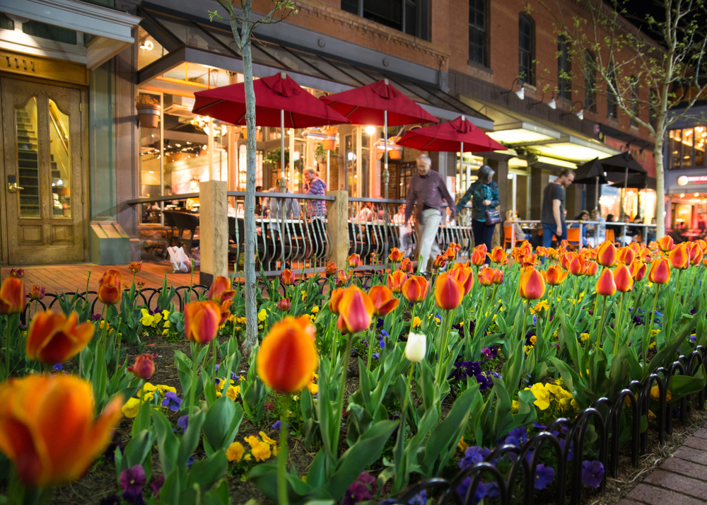
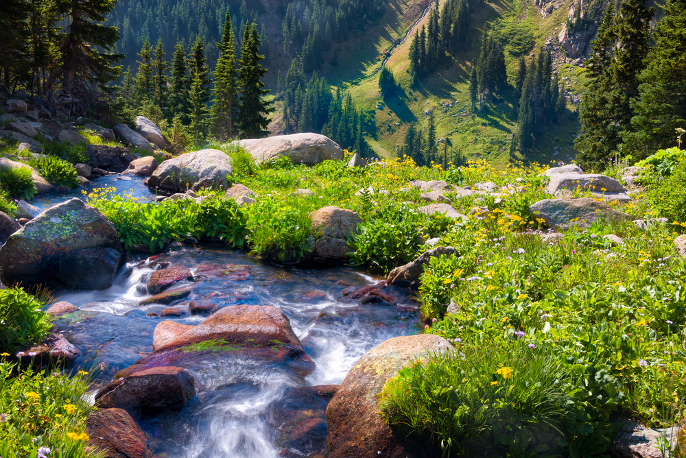

For the second year in a row Boulder, Colorado has been voted the number one place to live in America by the [US News & World Report](https://realestate.usnews.com/places/rankings/best-places-to-live). From its stunning natural beauty ranging from national parks, trails, and recreational areas to the thriving economy and lively neighborhoods, Boulder is attracting new homeowners nationwide and it’s easy to see why! Here’s some of what you can expect from taking up residence in this charming city!   

**The Natural Beauty**  
  
Nestled between the Rocky Mountains, Boulder is the right place for nature lovers, in fact, one quick search on TripAdvisor will have you getting your backpacks ready for a hike. From the scenic views of mountaintops in the Colorado Chautauqua Park to the incredible Boulder Falls Waterfall, anyone with a love of adventure and the outdoors will find themselves enamored by the natural beauty surrounding them in Boulder. All in all, Boulder offers 40,000 plus acres of land that are open to the public, over 60 parks, and more than 155 miles of hiking trails. Talk about impressive! In fact, US News & World Report writes, “Nearby Boulder Canyon is studded with climbing crags and serves as the fastest route to the high country, including Eldora Mountain Resort for skiing and snowboarding and numerous trailheads that lead to the alpine lakes and valleys of the Indian Peaks Wilderness. Rocky Mountain National Park is a little more than an hour’s drive away, as are many of Colorado’s famous ski resorts.” National Geographic also described the Flatirons, as a must-see for anyone who hasn’t yet experienced the sights, “Boulder’s most iconic landmarks are the Flatirons, a series of five slanted sandstone formations along the eastern slope of Green Mountain. For the outdoor enthusiasts of Boulder (and that’s just about everyone), the Flatirons are an enormous playground. Hikers have miles to explore, slackliners can hit the ropes, and climbers can test their skills on routes of all levels. For tips on starting out in the sport—or upping your game—book a session with guides at Apex Mountain School.”

A City Filled with Happiness   
In addition to having a lower crime rate than other cities its size, Boulder is celebrated for being one of the happiest cities in America and has even been awarded the title by [National Geographic](https://www.nationalgeographic.com/travel/article/happiest-city-united-states-boulder-colorado-2017). Boulder is not only known for providing incredible views but serving as a home for friendly neighbors! In fact, [US News & World Report](https://realestate.usnews.com/places/rankings/best-places-to-live) explains, “Take a stroll on the Pearl Street Mall, hike up Mount Sanitas, grab a coffee at Beleza Coffee Bar or a beer at the Rayback Collective, and it’s obvious that Boulder is packed with young professionals: techies, entrepreneurs, creatives and more. You’ll also see students around town, especially on “the Hill” near the campus of the University of Colorado-Boulder, the state’s flagship university. Families also account for a big presence in Boulder, attracted by the city’s relaxed vibe and schools that consistently rank among the best in the state.” [National Geographic](https://www.nationalgeographic.com/travel/article/happiest-city-united-states-boulder-colorado-2017) goes a step further in describing what you can expect when taking a stroll through the downtown historic district writing, “Restaurants and shops line the pedestrian-only Pearl Street Mall, a four-block stretch in Boulder’s historic downtown. Get fortified with coffee and a flight of pancakes at Snooze, then stroll along the red-brick road, browsing for unusual finds at local shops like Chelsea and Tough Luck Cowboy. For a look at some of Boulder’s finest artwork, pop in to SmithKlein and other Pearl Street galleries.” Talk about charm! Who wouldn’t love to find themselves walking around art shops and cafes!   

