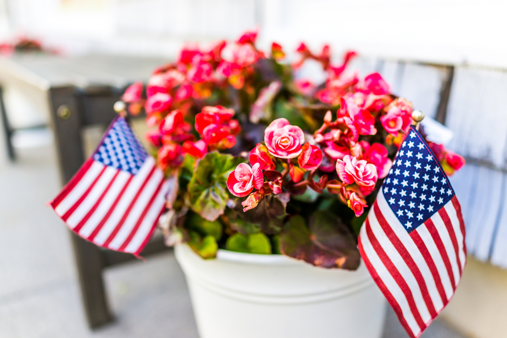
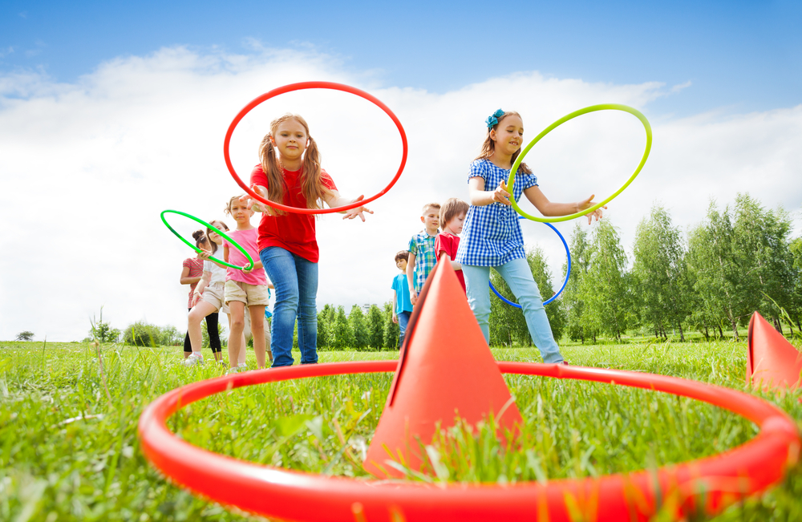

Memorial Day commences the season with warm, clear blue skies, and more outdoor time! Why not spend the day with family and friends by having a BBQ at home? With a mix of delicious foods, patriotic decorations, and fun games, we have a list of Memorial Day BBQ ideas so that you can host the best Memorial Day BBQ from the comfort of your own home!  

**Hot Dog Bar**  
  
What’s a BBQ at home without hot dogs? A hot dog bar makes for the perfect party food station. [The Spruce](https://www.thespruce.com/creative-memorial-day-party-ideas-4137220) suggests that “an elaborate hot dog bar is a fun way to turn a classic Memorial Day food into something new and exciting.” Guests can head to the hot dog bar with their grilled dogs and choose from a selection of toppings like fresh and pickled vegetables, condiments such as mustard, ketchup, mayo, etc., and even sides like beans and coleslaw, that can double as toppings! It’s a great way to cater to each guest with minimal effort.

   
**Patriotic Décor**  
  
A fun addition to our list of Memorial Day BBQ ideas is decoration! Show your patriotism and follow the red, white, and blue theme throughout all your decor. [Crate and Barrel](https://www.crateandbarrel.com/ideas-and-advice/memorial-day-party-ideas) recommends “big, colorful decor items first, such as a bright red or blue tablecloth or table runner. Flag-themed napkins and placemats can also be added to showcase the patriotic Memorial Day theme.” Keep the theme going by adding miniature American flags to any floral arrangement to create the perfect, yet simple patriotic centerpiece.  

   
**Outdoor Games**  
  
Regardless of whether there will be kids or strictly adults attending your Memorial Day BBQ, outdoor games are the perfect way to entertain! [Better Homes & Gardens](https://www.bhg.com/holidays/july-4th/traditions/fun-ideas-for-memorial-day/) says lawn games like “bags, ring toss, and horseshoes” are great games to initiate some friendly competition between guests! If you have a decently sized yard, outdoor sports games like volleyball, badminton, and/or pickleball are as easy as setting up a net! Aside from amusement, these different games can pose as the ultimate icebreakers for your guests.  

**Dessert**  
  
The best way to end your Memorial Day BBQ is with dessert! While there are many recipes to choose from for your BBQ at home, we have some ideas that make for some delicious, Memorial Day themed desserts. If there are kids joining in on the fun, [Ashley Furniture](https://blog.ashleyfurniture.com/memorial-day-party-ideas/) proposes to “just display some plain cupcakes and some basic cake decorating supplies such as vanilla icing and red, white, and blue sprinkles.” This is not only an easy recipe to make, but also keeps children excited and entertained. For a mess-free dessert, try making these yummy and simple [berry kabobs](https://www.parents.com/recipe/berry-patriotic/). All you’ll need is raspberries, marshmallows, blueberries, and wooden sticks! As summer approaches, so does the heat. Try picking up some red, white, and blue popsicles to help guests cool off after a fun day outside!
