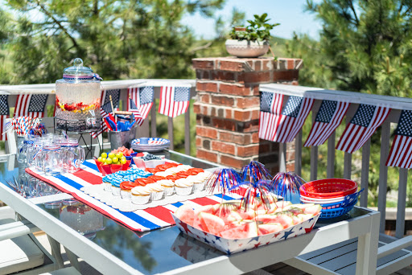
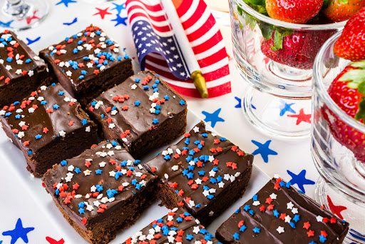

Independence Day aka the Fourth of July is right around the corner! Fireworks, barbecues, and beach days are all things
associated with the commemoration of America’s birthday. But if you’re looking for a new and fun way to celebrate this
Fourth of July weekend at home with your loved ones, we’ve got just the idea – a backyard movie night!

### **Theater Set-Up**

To prepare for your Fourth of July weekend celebration backyard movie night, it’s important to have all the necessities
ready to make your celebration easy and enjoyable. The two most important items that put the movie in backyard movie
night are a movie screen and a projector! [The Spruce](https://www.thespruce.com/backyard-movie-night-ideas-5120347)
recommends creating a [DIY Outdoor Movie Screen](https://liagriffith.com/easy-diy-outdoor-movie-screen/) out of a bed
sheet and a [DIY Movie Projector](https://thriftdiving.com/diy-movie-projector/) that pairs perfectly with your
smartphone. If you’d rather purchase a projector to save you
time, [HGTV](https://www.hgtv.com/lifestyle/entertaining/throw-an-outdoor-movie-night-party) suggests
a [Mini Outdoor Projector](https://www.bestbuy.com/site/miroir-element-m75-dlp-mini-projector-black/6341886.p?skuId=6341886&irclickid=VNVxFWSzixyIWX%3A2PqS0nWFMUkDzDtSRUTJ8Xc0&irgwc=1&ref=198&loc=Skimbit%20Ltd.&acampID=0&mpid=10078)
that is not only highly rated but is also light enough to carry around. After this party, your friends and/or family
will be begging to borrow it! Next up on the list are the seating arrangements. Between chairs, bean bags, pillows, and
blankets, guests can bring their desired form of seating to get comfy and cozy just in time for the showing. A final
part of your backyard movie night is… tickets! Print out paper tickets to give to your guests as they walk in, making
the experience as real as possible!

### **Fun and Festive Fourth Décor**

Get into the festive spirit in the comfort of your own home by adding in some patriotic Fourth of July
décor! [Country Living](https://www.countryliving.com/diy-crafts/g3408/4th-of-july-party-ideas/) proposes using red,
white, and blue tablecloths with mini American flags in a vase as the centerpiece. String lights and banners can also be
hung up outside to add to the ambiance. To create your own
banner, [Home Edit](https://www.homedit.com/4th-of-july-diy-decorations-and-ideas/) advises creating a fun tassel made
up of patriotic colored plastic tablecloths! Another great décor idea that ties in perfectly with your Fourth of July
weekend celebration movie night is
a [Fireworks Popcorn Bucket](https://www.bhg.com/holidays/july-4th/decorating/easy-diy-decorations-for-the-4th-of-july/?slide=slide_585b3324-ff8c-4709-90e1-7ee1b0e0eb0e#slide_585b3324-ff8c-4709-90e1-7ee1b0e0eb0e).
With an unused container and patriotic colored paper, guests can enjoy their movie theater popcorn, festively!

### **Movie Snack Time**

The best part of this backyard movie night is the snacks! Who doesn’t enjoy munching on delicious treats while watching
a movie? A perfect way to cater to all your guests is by putting out a concession stand, as recommended
by [BHG](https://www.bhg.com/party/backyard-activities/host-a-backyard-movie-night/?slide=slide_4e8c25da-65c0-445b-b712-a4c8fb7a8a93#slide_4e8c25da-65c0-445b-b712-a4c8fb7a8a93).
All you’ll need is a long table and a variety of candies, popcorn, nuts, fruits, crackers, and chips to allow guests to
choose whichever they prefer, if not all! If you’re looking to add to the patriotism of your Independence Day
celebration, some delicious snacks to make
are “[Fourth of July Dipped Oreo Flags](https://www.craftymorning.com/4th-july-dipped-oreo-flags/),” “[American Flag Marshmallow Pops](https://www.twosisterscrafting.com/american-flag-marshmallow-pops/),”
and “[Stars and Stripes Sugar Cookie Bars](https://delightfulemade.com/stars-and-stripes-sugar-cookie-bars/).” To finish
off your backyard movie get-together on a warm, summery
night, [Good Housekeeping](https://www.goodhousekeeping.com/food-recipes/g4316/fourth-of-july-drinks/) mentions
this [Basil Berry Lemonade Sorbet](https://www.goodhousekeeping.com/holidays/g1748/red-white-blue-july-fourth-desserts/?utm_source=google&utm_medium=cpc&utm_campaign=arb_ga_ghk_d_bm_prog_org_us_g1748&gclid=CjwKCAjwtcCVBhA0EiwAT1fY77ok4rTuMdS6a-wWrNohf22Rzcv-WKBPXeaM7SD2Te3uD1hudA3VXhoCq40QAvD_BwE&slide=24),
as the perfect treat to cool guests off and end the night.
