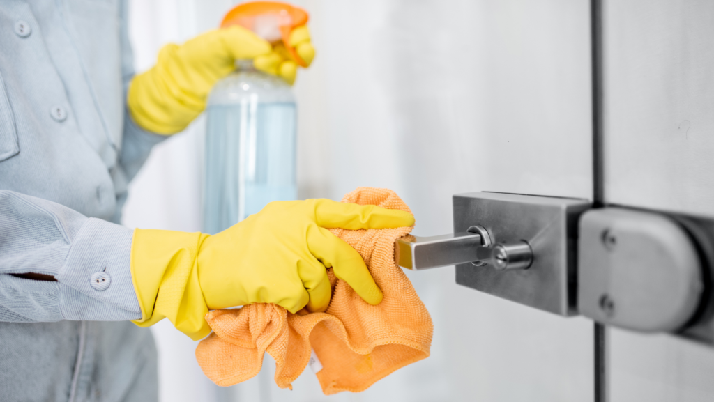
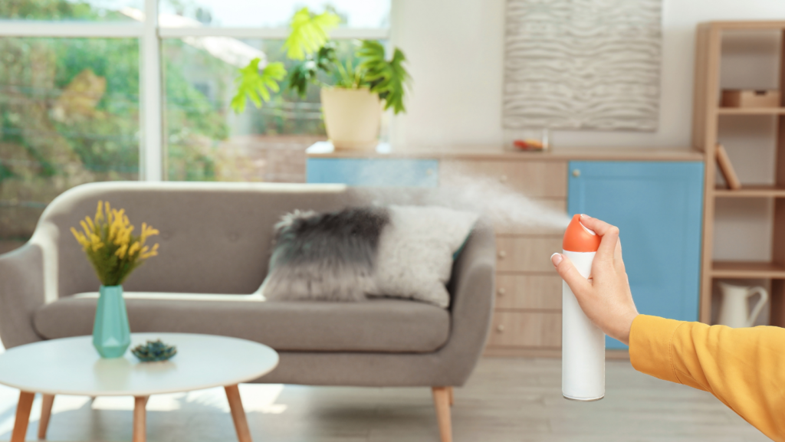

We know the last few months of the year can be full of parties, plans, and chaos that gives you little time to care for yourself, let alone your home. And after a crazy time like the holidays, it can feel very therapeutic to declutter and get rid of the germs and mess that were undoubtedly welcomed into your home. To motivate you to press the reset button for the new year, we gathered a few easy and effective ways to clean your space. Once you’ve knocked out these steps, you’ll be able to start the year refreshed and enjoy your happy, healthy home.   

### **1\. Purge and De-Clutter**   

The start of the new year calls for both a clean-up and a clean-out. And we’re not just referring to the  holiday décor that’s still lingering around your home... Your closet, shelves, and drawers that are full of unneeded knick-knacks need some love, too! It’s also necessary to take a good look at the contents in your fridge and pantry so you can throw out expired food items or donate non-perishables that won’t get eaten. Step one to obtaining a clutter-free home: rid of household items that take up space and no longer serve you. Donating to your local [Goodwill](https://www.goodwill.org/) is one thoughtful way to “out with the old”!   

### **2\. Organize**

Once you have all your necessities in check, the next (and most satisfying step of all) is to organize! A helpful tip to keep top of mind is that every belonging should have a designated spot it resides when not being used- whether that be in a drawer, bookcase, closet, or shelf. You can organize your possessions using clear containers, decorative baskets, drawer categorizers, wracks, hanging shelves, or literally anything from [The Container Store](https://www.containerstore.com/welcome.htm). And if organizing makes you as excited as some, maybe you throw a little color coding or labeling into the mix...  

### **3\. Clean and Sanitize**

‘Tis the season for colds, cases of flu, and everything else in between! So, what better way to feel comfortable in your home than by giving it a deep cleaning and ridding all your surfaces of unwanted winter germs? Start 2023 with a cleansed area by doing it all- moving the furniture to dust, vacuum, and mop, wiping the windows and blinds, scrubbing the fridge and oven, and of course cleansing the bathrooms. It’s also important to hit the areas that we often forget about such as the chimney or ceiling fixtures and corners/cracks that are out of eye-level view. Here is a helpful guide to the [best cleaning products of 2022](https://www.purewow.com/home/best-cleaning-products) for all your cleaning inspiration!  

### **4\. Freshen Up** 

Now that your home is clean and organized, you have the freedom and opportunity to make it feel fresh! To start, open the windows to breathe fresh air into your home or awaken scents inside the home through fresh flowers or lighting a candle. Other, more extensive ways to freshen your space would be through washing rugs, window treatments, or throw blankets. Rearranging furniture and flipping your mattress is also a good way to help energize your rooms. Feeling refreshed is crucial for your well-being on many levels, and that sense of cleanliness should always start at home! 

