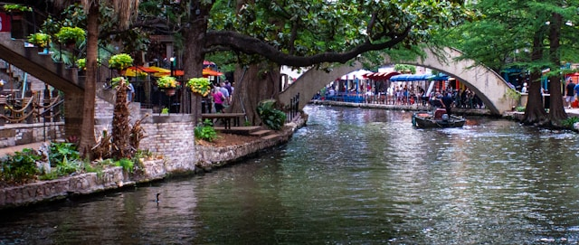
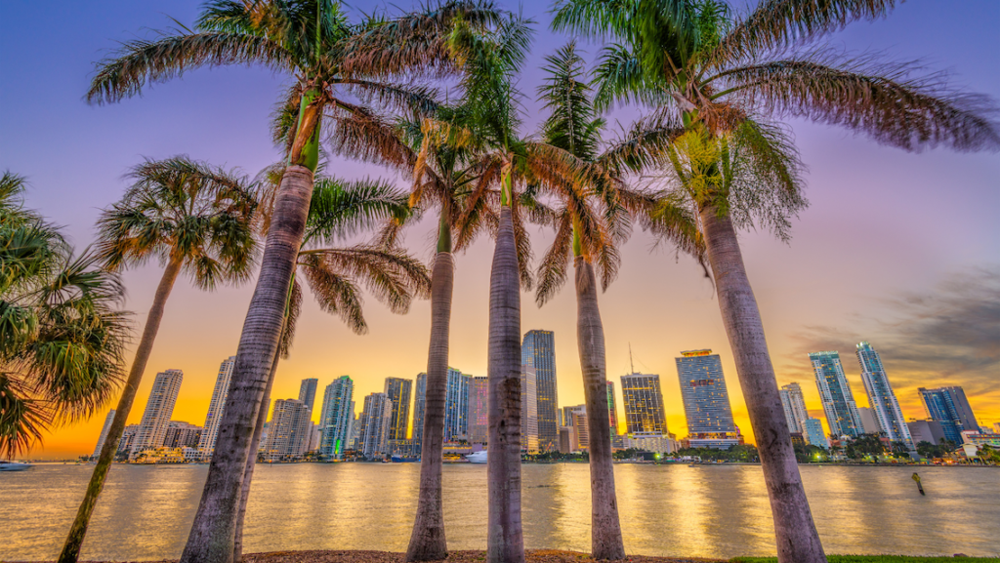
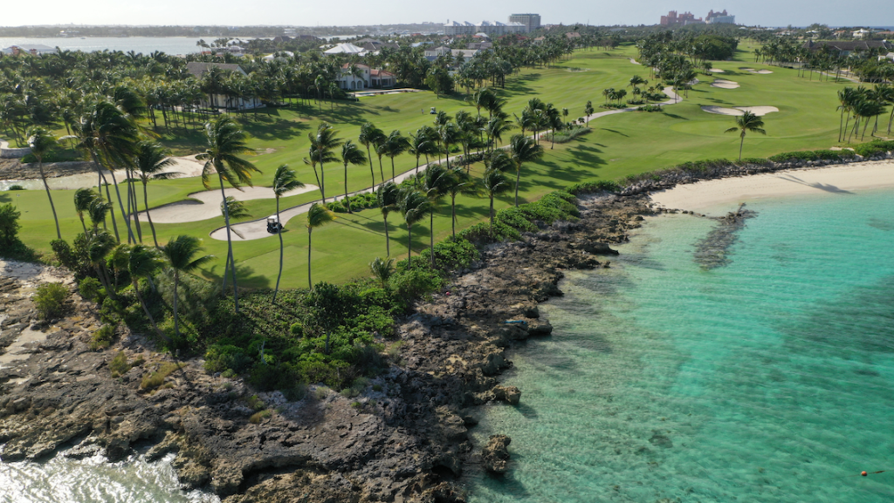
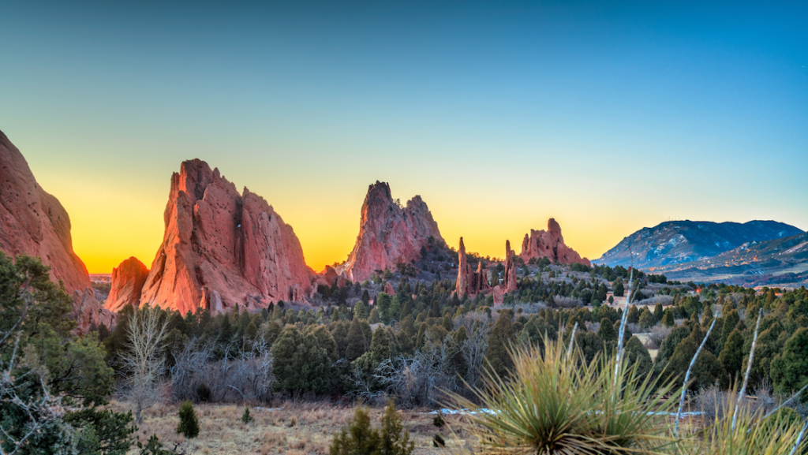

It is officially February and love is in the air! From coast to coast and city to city, we hope you feel all the love that comes with the month of February. And that love can stem from anywhere! Our challenge to you this month is to fall in love with where you are in the present moment- fall in love with your city!  

Have you called your city home for a while? Are you feeling uninspired where you are? New to your area and looking for some direction? No matter your situation, we have ideas to reignite that spark with the place you call home! Based on the top 15 cities lived in by our clients, we have compiled some unique ways to help you feel proud to be a local.  

#### 1\. Houston, TX   

They don’t call Houston "Space City" for nothing! This Texas town is home to NASA's Manned Spacecraft Center and is also known as the most ethnically diverse metropolitan city in the US- rodeos, cowboy boots, and all! No matter what local restaurant or coffee shop you visit, you are bound to find neighbors from all walks of life in HTX. And speaking of walking, Houston has some of the longest underground tunnels that stretch for a whopping 7.5 miles! Consider taking a stroll through these underpasses to help you feel more "grounded" in HTX. 😉  

#### 2\. Las Vegas, NV  

Famous for its casinos, fine dining, and endless live entertainment options, Sin City is labeled as THE spot for a wild night out. But Vegas should not be limited to this one persona ! The greater Vegas area is home to some of the best nature views and wildlife in the US. Black Canyon and Antelope Canyon are two of the most gorgeous canyons located right outside the heart of Las Vegas. If you are in Vegas and looking for a way to find extra appreciation for your city this year, plan a visit. You are bound to fall in love with the diverse wonders of LV all over again.   

#### 3\. San Antonio, TX  

San Antonio hosts the most visited tourist attraction in Texas: the Alamo. As you have likely toured the Alamo a time or two, we recommend going off the beaten path to explore more of what your city has to offer, like the Japanese Tea Garden. At no charge, you can frolic through the colorful garden and stand below a 60-foot waterfall. Talk about views! Or you can always go the culinary route and gradually try [every restaurant on the San Antonio Riverwalk](https://www.sanantonioriverwalk.com/san-antonio-riverwalk-restaurants/) to discover your favorite along the way.  

#### 4\. Chicago, IL  

February is a chilly month in the Windy city, but don’t let the weather prevent you from enjoying all that Chi-Town has to offer! Some of the best museums & aquariums in America are located in the heart of Chicago. The rich American history in this city is debatably just as spectacular as the food and sports teams that dominate the Chicago culture. One thing that is for sure is that Chicago has never-ending opportunities to learn, evolve, and stay inspired.   

#### 5. Philadelphia, PA  

When you think of Philadelphia, it is hard not to salivate at the thought of a Philly cheesesteak. Some believe all it takes is one Philly food tour to get you hooked- but the history and monumental moments that took place in the city play a big part too. Iconic landmarks like the Liberty Bell, Betsy Ross’s home, and Edgar Allen Poe’s home continue to stand in Philly, frozen in time. Being able to walk past these structures ought to give locals a sense of pride to be part of a community that has seen so many historical happenings.   

####  6. Miami, FL  

Known for its nightlife scene, pristine beaches, and cultural fusion, Miami is seen as the place to be! However, if you call Miami home, it is probably easy to overlook the glamour everyone sees from the outside looking in. Here is one way to fix that: plan a staycation! Wine and dine in Miami like you are visiting for the weekend, and you will quickly remember why it is so easy to get caught in the Miami heat.   

#### 7\. Orlando, FL  

Did you know Mickey Mouse is not the only intriguing animal to strut the streets of Orlando? We are all familiar with the thrill the Orlando amusement parks offer, but have you observed the wildlife in the preserves, wetlands, or state parks? There are copious amounts of exotic animals and landscapes around Orlando that will help you appreciate the city for all its worth.   

#### 8\. Cape Coral, FL  

Some call Cape Coral the “waterfront wonderland”, as it is home to over 400 miles of canals. That is a lot of canals to cover! But, as a resident, how often do you take the time to explore? There are so many coveted areas to kayak or picnic along these waterways. You can also get lost in Cape Coral’s 4-mile ecological preserve to enjoy nature’s untouched beauty. Another Florida city with bountiful outdoors!  

#### 9\. Jacksonville, FL  

One of the best things about Jacksonville’s location is its accessibility. When you are feeling bored of the area or ready for a change of scenery, take a day trip. The beautiful beaches and towns of St. Augustine, Daytona, and Hilton Head are just a car ride away. Taking advantage of this prime location along the north Atlantic Ocean will give you more appreciation for your city- and hopefully, make you excited to return home.   

#### 10\. Myrtle Beach, SC  

The pretty beaches of Myrtle Beach run 60 miles along the coastline- a stretch known as the Grand Strand. The Grand Strand gives plenty of opportunities for outdoor activities, one of the most popular being golf- as the area is credited for its [many beautiful, green courses](https://www.mbgolf.com/golf-courses/). And we haven’t even covered the endless food options in this town! Between relaxing on the beaches, staying active outside, and indulging in the seafood, your entertainment in Myrtle Beach is infinite!  

#### 11\. Albuquerque, NM  

Fun fact: Albuquerque is the highest metropolitan area in the US. So, it is no coincidence that the city is home to the one and only International Balloon Fiesta! Fiesta or no fiesta, it seems like it would be hard to get bored in a beauty like New Mexico. Try romanticizing your time in Albuquerque by hiking the Ria Grande Valley or the Sandia Mountains. If anything, walk outside your door and find new trails or nature sightings right at your fingertips!   

#### 12\. Colorado Springs, CO  

Not everyone gets to live in a place cool enough to be called “Olympic City”. Beautiful ski resorts are a given in Colorado Springs, but have you made the most of living near the Garden of the Gods? You can go back as many times as you want and still find a new area to explore or an awesome view that is new to the eye!   

#### 13\. Tampa, FL  

Home of the IDEAL AGENT headquarters! Oh, and a few other cool spots... 😏 Kidding aside, Tampa has so much to offer- easy access to Gulf Coast beaches, three killer sports teams, the original Busch Gardens, and is known as the birthplace of the Cuban sandwich! If you are an outdoorsy, sports-loving, food-loving individual, you are bound to enjoy your time in Tampa.  

#### 14\. Indianapolis, IN  

As the racing capital of the world, there is nothing more electric than the month of May at the Motor Speedway in Indianapolis. But it is important to keep that passion for the city alive even during those brutal winter months! A few ways to keep your love for the city fresh may be to explore the 25-mile-long Monon trail and Central Canal downtown or by visiting the ever-evolving Newfield's and Children’s Museum.   

#### 15\. Cincinnati, OH  

Last but definitely not least, this lovely Midwest city was once known as the "Beer Capital of the World"! Home to over 50 breweries, you can fall back in love with Cincinnati one brewery at a time. And if you want to feel even more connected to Cinci's roots, you can explore a lot of the [city underground](https://www.visitcincy.com/blog/post/unmistakably-cincinnati-underground-experiences/)! From brewery tunnels to caves, to crypts, to abandoned subway stations, Cincinatti’s history is one you need to dig a little deeper for.  

We hope you learn to love where you are this Valentine's Day. Because to love your city is to love your home. And you know what they say... home is where the heart is. ❤️
