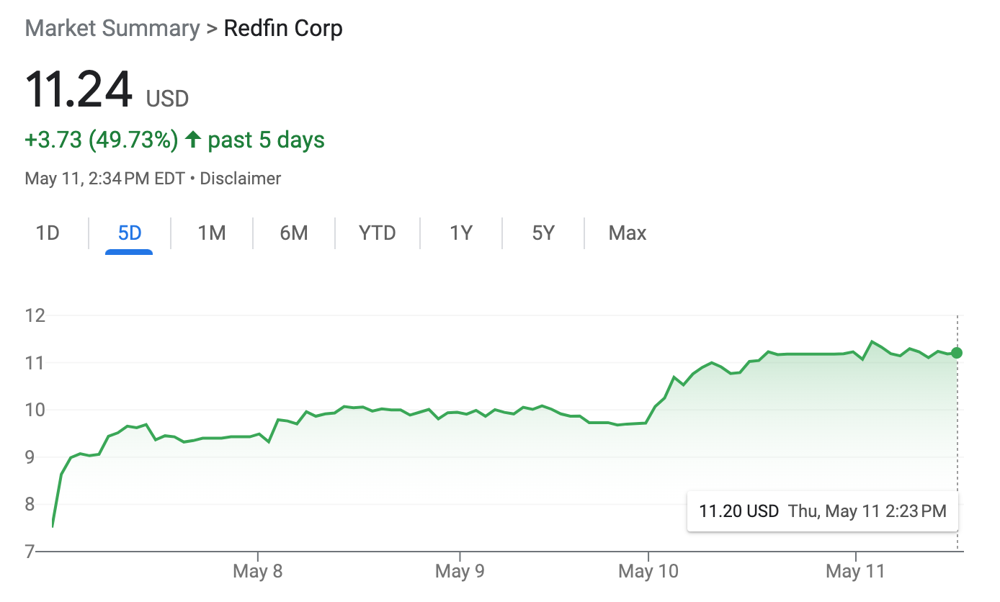
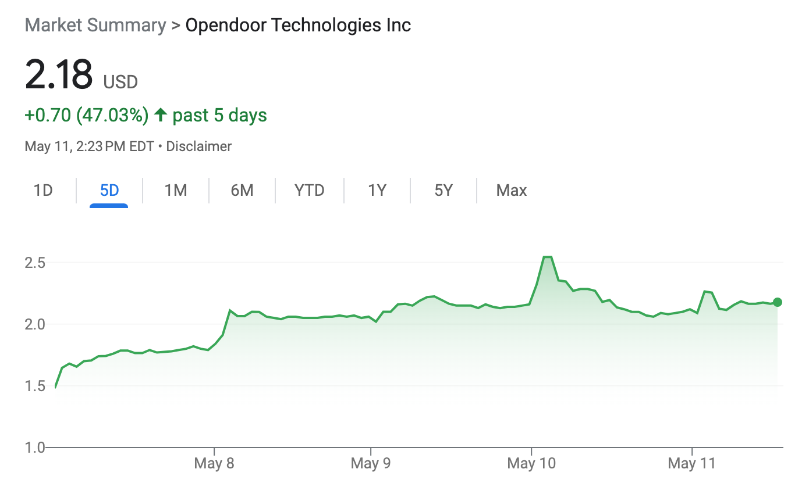
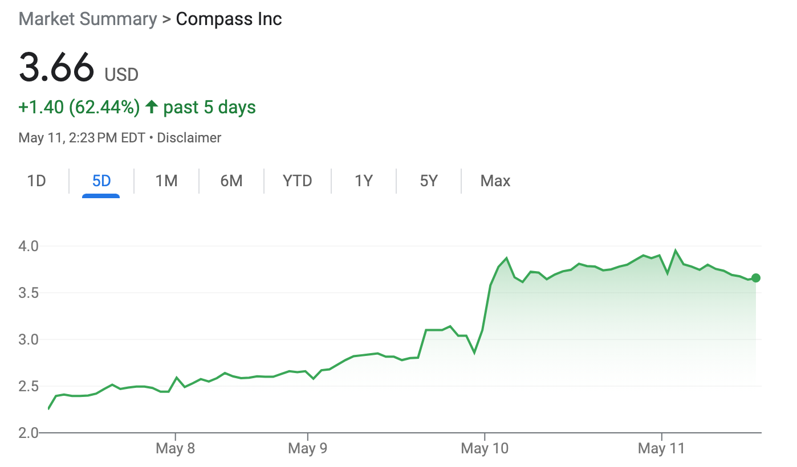
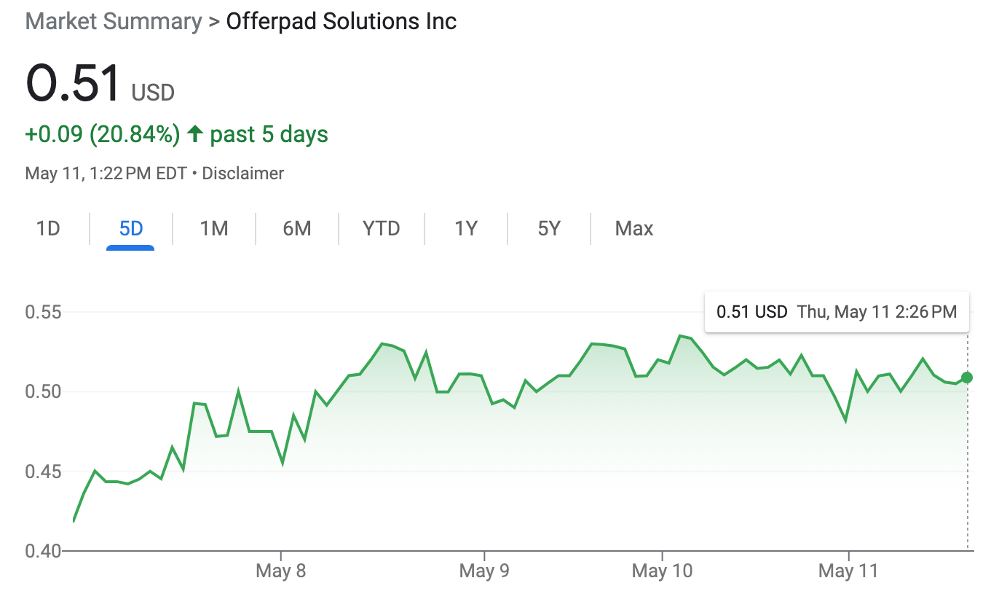

Redfin, Opendoor and Compass have all seen their share prices rally in recent days — suggesting that after years of the cold shoulder investors are warming to the sector

Stable Diffusion

BY [JIM DALRYMPLE II](https://www.inman.com/author/jdalrymple/)

May 11, 2023

_In these times, double down — on your skills, on your knowledge, on you. Join us Aug. 8-10 at Inman Connect Las Vegas to lean into the shift and learn from the best._ _[Get your ticket now for the best price.](https://events.inman.com/inman-connect-las-vegas)_

After an interminably long and dark winter, the bears — it seems — are gone. The bulls are back in town.

That’s the takeaway, at least, from multiple real estate companies’ remarkable rallies in the stock market over the last week. The rallying began on May 5, when [Redfin](https://www.inman.com/2023/04/13/redfin-lays-off-201-staffers-in-third-round-of-painful-cuts-since-june/) shares began a climb from just over $7 to, as of Thursday afternoon, more than $11. All told, over the last five days of trading Redfin shares had risen nearly 50 percent by the time markets closed Thursday.

Credit: Google

Opendoor experienced something similar over that same period. Five days ago, shares in the iBuyer were trading for less than $1.50. But by Thursday afternoon, they were trading for around $2.16 — also nearly a 50 percent rise. On Wednesday, they had also been trading even higher, at one point hitting more than $2.50.

Credit: Google

The rally didn’t stop there, though.

On Wednesday, Compass shares shot up, rising from just over $2.80 to nearly $3.90. Shares fell a bit Thursday but were still trading above the mid $3 range — up more than 60 percent over five days.

Other companies have enjoyed smaller, but still meaningful rallies. As of Thursday afternoon, Offerpad shares were up more than 20 percent over the last five days. And Fathom Holdings had risen about 27 percent during that period.

Credit: Google

The obvious thing that set off the rally was the latest round of earnings reports. Both [Redfin](https://www.inman.com/2023/05/04/redfin-narrows-losses-as-revenue-falls-45-in-first-3-months-of-2023/#:~:text=Redfin's%20Q1%20revenue%20declined%2045%20percent%20year%20over%20year%20to,to%20achieve%20success%20in%202023.) and [Opendoor](https://www.inman.com/2023/05/04/uncertain-housing-market-curbs-opendoor-revenue-as-q1-losses-rise/) reported earnings on May 4, which in turn led to gains when markets opened the next morning.

But for the uninitiated, the reports might not have automatically seemed like clear winners. Opendoor revealed, for example, that revenue was down year over year in the first quarter, and that it lost $101 million. It was a similar story at Redfin, where revenue fell and losses ultimately totaled $60.8 million in the first quarter.

What appears to have appealed to Wall Street investors, however, is that in both cases losses _narrowed_. Yes, the companies burned through significant amounts of cash. But their respective [cost-cutting measures](https://www.inman.com/2022/06/03/from-better-to-worse-real-estate-companies-making-layoffs-so-far/) over the last year appear to have set the companies on the right trajectory — at least in the minds of traders.

The same goes for [Compass](https://www.inman.com/2023/05/09/compass-revenue-drops-in-q1-but-losses-continue-improvement/#:~:text=Compass%20had%20a%20market%20cap,the%20fourth%20quarter%20of%202022.), which lost $150 million in the first quarter but which was also quick to point out that such a loss was a year-over-year improvement.

[Offerpad](https://www.inman.com/2023/05/03/offerpad-narrows-losses-despite-another-quarter-of-falling-revenue/) and [Fathom](https://www.inman.com/2023/05/11/fathom-realty-narrows-losses-but-agent-growth-slows-in-q1/) had similar earnings reports, and indeed the phrase “losses narrow,” or something similar, appeared in headline after headline over the last week.

This may all seem like an obvious and simple story of good earnings sending shares soaring. But it’s actually a little more complicated.

That’s because many of these companies actually saw their shares peak all the way back in early 2021. Redfin, for example, saw shares rise to nearly $100 in February of that year. Opendoor shares hit nearly $35 during that same period. Compass hadn’t gone public yet at the time, but when the brokerage made its stock market debut a couple months later, shares [came out of the gate](https://www.inman.com/2021/04/01/compass-stock-closes-at-19-75-per-share-on-first-day-on-the-market/) at more than $20.

At the time, the U.S. was about a year into the [coronavirus pandemic](https://www.inman.com/2020/05/20/read-all-of-inmans-coronavirus-coverage-here/), and demand for both housing and cheap loans was off the charts.

But then something weird happened: For the next two years, virtually every real estate company saw its share price drop like a rock. Redfin shares ultimately fell to barely more than $3. Compass shares dipped to less than $2. Opendoor shares briefly dropped below $1 — a critical threshold above which companies have to stay lest they risk being booted from the stock market.

Companies such as eXp World Holdings and Zillow — which haven’t enjoyed the massive rallies of their rivals over the last week — also hit high points in early 2021, then spent the next two years watching their share prices lose value.

This trend continued despite a robust real estate market throughout 2021 and despite the fact that many of these companies rode that market to new revenue highs. There were, in other words, many positive earnings reports over the last two years that nevertheless failed to reverse a general downward trend in share prices.

When the market soured in 2022 amid suddenly high rates, [the market carnage continued](https://www.inman.com/2022/09/02/real-estate-stocks-are-getting-absolutely-destroyed-right-now/) — in some cases ultimately [prompting questions](https://www.inman.com/2022/08/01/a-pivotal-earning-season-is-beginning-heres-what-to-know/) about the viability of some companies or business models.

This latest rally consequently suggests that after a long two-year period, investors might finally be warming to real estate once again. Such a hypothesis is supported by the fact that the [Federal Reserve recently signaled](https://www.inman.com/2023/05/03/fed-signals-it-may-be-done-raising-rates-but-powell-wont-talk-pivot/) it may stop raising rates, [NAR thinks the bottom](https://www.inman.com/2023/05/09/nar-chief-economist-the-fed-made-a-mistake/) of the market for total home sales may happen soon, and multiple reports have indicated [a seller’s market is back](https://www.inman.com/2023/05/10/the-sellers-market-is-roaring-back-as-buyers-vie-for-limited-inventory/).

All of this news also likely feeds into the warm feelings investors have shown toward real estate companies lately — though the fact that not every company is rallying suggests recent headlines aren’t entirely responsible for share price gains. The earnings reports are still a critical part of the story.

But in any case, change is definitely in the air.

That doesn’t mean, of course, that real estate stocks are out of the woods. Everyone is still way down compared to their 2021 highs. Offerpad, despite its rally, is still trading below that $1 threshold, meaning a question mark hangs over its future stock market status. Investors could cool on real estate in the coming days. The rally could end or go into reverse.

But for now, the gains are significant. Opendoor shares haven’t traded as high as their current price since last fall, meaning this week’s rally reversed months of losses. At $11 per share, Redfin’s stock is within striking distance of its 52-week high of about $13 per share. Opendoor is much less at risk of once again falling below $1. It doesn’t look like Compass will ultimately approach that threshold — something that wasn’t a given when shares were below $2.

Robert Reffkin

That may all be why, in their earnings reports, company leaders over the last week have been somewhat upbeat. Among them, Compass’ Robert Reffkin described himself as “cautiously optimistic” and said buyers have finally adjusted to the new normal of high rates.

“I believe that the golden age of Compass is ahead of us,” Reffkin concluded during an earnings call. And after the last week, other leaders surely feel similarly about their own firms.
