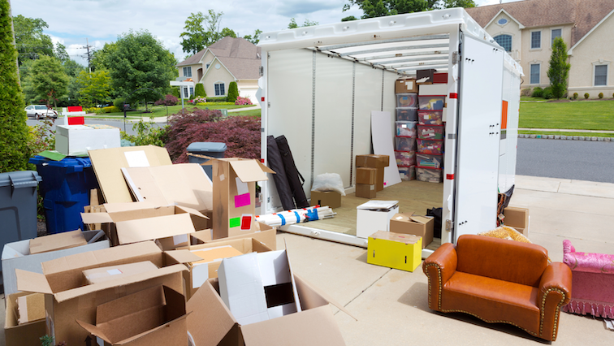

Are you looking to sell your home soon? If so, now is the time to prepare for listing! Here are a few key things to consider when getting your home in tip-top shape for open house season.       

## 1\. Remove Excess Furniture & Clutter     

It is crucial to scale down the contents inside your home to help your house feel spacious when putting it on the market to be toured. If you get rid of unneeded furniture or décor, it will give an illusion that the rooms are bigger than otherwise perceived. In fact, it is recommended that you remove at least 50% of your items when properly staging a house for potential buyer walk-ins. You can de-clutter by utilizing storage bins and tucking them inside closets, under furniture, or in areas that won’t be visible to a buyer. Or, if space is an issue, take into account all the items you can move to a rental storage unit once you are ready for your home to hit the market.     

## 2\. Clean    

There is nothing less appealing to the eye than dirt and grime in a comfortable space. It is important to remove all signs of mold, mildew, stains, and dust prior to letting buyers into your home. Showing extra love to the carpets, grout in the flooring, and bathroom/kitchen appliances will do your home justice. No matter how long your home has been around, if you maintain its cleanliness it will feel like new! The same goes for the landscape and exterior of your home. There is always the option to hire help to do the dirty work for you, or you can refer to our [last blog](https://blog.idealagent.com/the-ultimate-new-years-home-cleaning-guide/) for helpful advice to get the job done yourself!    

## 3\. Paint Where Needed    

One rule when going to paint: always start with the front door. Curb appeal is everything, and you can never re-do a first impression! When it comes to giving the walls in your home a smoother look, we recommend going with [neutral, warm colors](https://www.veranda.com/home-decorators/g34714319/neutral-paint-colors/) like tans and greys. If you were looking for an excuse to paint over the vibrant, neon colors of the kid’s room, now has never been a better time! Fresh paint can make a room look newly done and appear bigger to the eye.  

## 4\. Depersonalize     

We recommend taking down and putting away personal items such as initials, religious/political items, and family photos when hosting open houses. This will help potential buyers visualize themselves and their belongings inside your home. Even the Hallmark sayings on the wall may be pushing it because not everyone relates. The best thing you can do to help people picture their life in your space is to depersonalize and generalize.    

## 5\. Connect With a Top Agent    

Last, and most definitely not least, it is in your best interest to connect with a top agent to give you further guidance before listing your home. An experienced agent will provide you with expert advice and ideas for needed updates specific to your home. Visit [idealagent.com](https://idealagent.com/) to get connected with the top agent in your area. With our invite-only network, you are guaranteed to get the best results and save thousands in commissions. So don’t hesitate to sell this spring- we have your back!  

