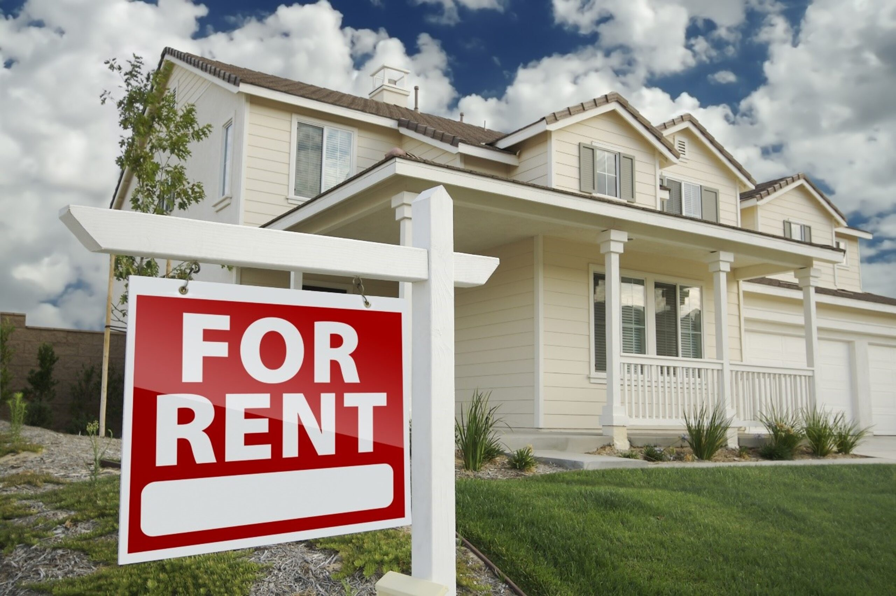

What is house hacking? In real estate, it's a savvy strategy to turn your home into a source of income. House hacking typically means purchasing a multi-family property and living in one of the units while renting out the others to cover mortgage costs. Whether you're an experienced real estate investor or a homeowner looking for a creative way to pay your bills, house hacking can be attractive.

In this blog, we'll walk you through the keys to successful house hacking, from tenant screening to financing options and more. We'll also cover some of the risks and responsibilities you'll run into. Let's jump in and discover if house hacking is the right strategy for you. 

## How to House Hack in 3 Steps  

Sometimes called rent hacking, house hacking requires in-depth knowledge of finances and real estate. At its core, it means leveraging rental income to offset your housing expenses — meaning your residence can also serve as a source of passive income.  

### **Find a Property** 

The process starts with finding a multi-unit or multi-family property that can serve as your primary residence, determining if you qualify to purchase it, and finding a real estate agent to get you started. But what makes a good house hacking property? Let's go over a few attractive characteristics: 

- **Property Type:** While multifamily properties like duplexes are common in house hacking, single-family homes can also be a viable option if they have additional dwelling areas like finished basements, convertible spaces, or a [mother-in-law suite](/what-is-a-mother-in-law-suite) that can be rented out.  
- **Location:** Search for areas with rental demand. Factors at play include good schools, low crime rates, and access to public transportation.  
- **Condition of the Property:** If you're considering a fixer-upper, make sure you're aware of the investments required — both financial and time-wise. If you're looking for a quick source of rental income, choose a property with minimal work needed. But if you don't mind getting your hands dirty, learn more about [how to find a fixer-upper house](/how-to-find-a-fixer-upper). 
- **Zoning and Regulations:** Local zoning laws and even HOA regulations may restrict short-term rentals, so read up on these before selecting a property. This is part of the search where you may notice the benefits of using a real estate agent. 

_Tip: Not sure how much mortgage you can afford? Try a mortgage affordability calculator._  

### Calculate your NOI 

To calculate the value house hacking could bring you, determine the net operating income (NOI) for the unit or units you'll rent out. Here's a simple formula for your calculations:  

**NOI = Gross Rental Income - Operating Expenses** 

Here's a breakdown of the components: 

1. **Gross Rental Income:** This is the total income generated from the property, including all rent payments and other income sources like laundry facilities and parking fees. 

2. **Operating Expenses:** These are the costs of maintaining and operating the property. This includes property management fees, maintenance costs, property taxes, insurance, utilities not paid by tenants, and any other recurring expenses necessary to keep the property functional. It does not include mortgage payments or capital expenditures, like renovations or significant repairs. 

**Compare to Your Expenses** 

Once you've determined the NOI from the units you'll be renting out, compare it to your monthly mortgage payment on the whole property. If you can reasonably charge more in rent than the cost of your mortgage payment, that extra income can be put towards other expenses or even saved. This is where the "hacking" term comes in —you're essentially living in your home for free.  

## House Hacking Pros and Cons 

Now that you know how to get started on your home hacking journey, let's go over some of the risks and benefits that come with the territory. It sounds great to turn your home into a passive source of income, but it's important to be aware of the pros and cons to determine if house hacking is right for you.  

### Benefits of House Hacking 

The first and most apparent pro when it comes to real estate hacks is **passive income generation/reduced living expenses.** Renting out a portion of your property provides an additional, steady stream of income you can use to cover your mortgage or other bills, or even save or invest for the future.  

**Tax advantages** can also be an alluring benefit. Landlords are sometimes eligible for tax deductions like mortgage interest, property taxes, maintenance costs, etc.  

Purchasing a property to be used as your primary dwelling also means **easier financing** than buying a commercial property. This strategy is a great way to get into real estate investing without a huge upfront cost.  

If you're considering becoming a full-time landlord, house hacking can be a great **entry into property management.** Dealing with a small number of tenants will help you determine if the industry is a good fit for you.  

### **Risks of** **House Hacking** 

**Lifestyle changes** and **privacy concerns** are a major consideration when you're considering renting out part of your home — particularly if you plan to share common areas or outdoor space. You may have to sacrifice some time, freedom, and privacy to make it work.  

**Landlord duties** are typically left at work after property managers are off the clock, but you'll need to be prepared to take on tenant issues, maintenance requests and more while at home.  

**Finances and insurance** can be a bit complicated when it comes to home hacking. Insurance must cover your primary dwelling _and_ the rental portion of your home. Plus, you may be putting yourself at risk for financial challenges if a tenant can't afford or fails to pay rent, or if significant maintenance issues arise unexpectedly.  

**Is** **House Hacking** **Right for You?**  

Now that we've been over the risks, benefits, and steps to start house hacking, it's time to decide if it's right for you. If you're ready to make the leap, IDEAL AGENT can help. [Contact us today](https://idealagent.com/) for help selling your old home or buying a new one!  

## House Hacking FAQs

 Where do I start with house hacking? 

The best place to start is by researching the process, pros, and cons of house hacking — which we cover in this article. If you’re ready to begin your search, contact us to [connect with a real estate agent](https://idealagent.com/).  

What are the pitfalls of house hacking? 

Risks of house hacking include legal and financial complications, lifestyle changes, and a new set of landlord responsibilities.  

Does the 1% rule apply to house hacking? 

The 1% rule refers to charging 1% of a property’s value as the rent price. The rule is not as relevant in house hacking since the tenants do not occupy the whole property. Instead, ensure you can charge enough for rent to cover most or all of your mortgage payment.
