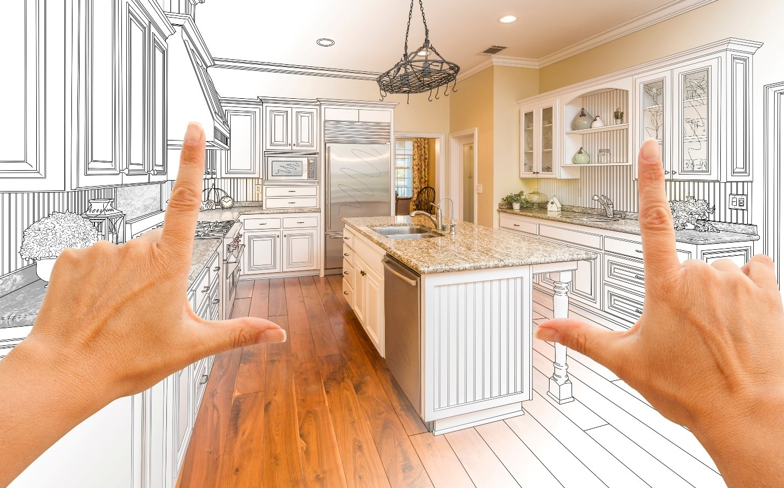
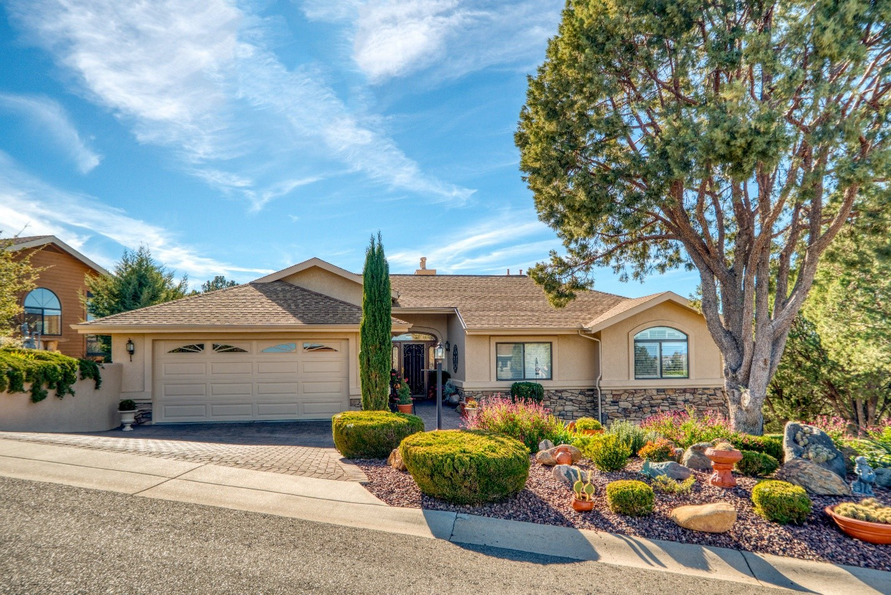

Finding and renovating a fixer-upper home seems fun and easy. But there's much more to it than we see on the screen. While finding a home to fix up can be a great adventure (and investment), it comes with many challenges.

Luckily, we've created this guide to buying rehab property that will give you the knowledge to find that diamond in the rough and turn it into your polished masterpiece. We'll cover how to identify, evaluate, and secure a home to fix up — all while staying on track with your vision and budget.  

## **Who Should Buy a Fixer-Upper?** 

Anyone can buy a fixer-upper, but it seems to be more common among two demographics: first-time homeowners and real estate investors. Let's break down the difference between the two.  

### **First-Time Homebuyers** 

For these buyers, the appeal of a fixer-upper isn't just the potential to customize their new home; it's also the affordability of a house that needs a little work.

Purchasing a property needing some TLC can be a wise financial decision _if_ you're ready to roll up your sleeves and put in some hard work.

It allows for a more affordable entry into homeownership and a valuable learning experience in home maintenance and renovation. With the right property, first-time buyers can gradually build equity while increasing the home's value.  

### **Real Estate Investors** 

Savvy investors know an opportunity when they see one, and they typically know how to buy rehab houses. And fixer-uppers offer the chance to purchase at a low price point, renovate efficiently, and sell at a profit. The key to success in this kind of investment lies in choosing the right property and location, accurately estimating costs, and executing the transformation with quality in mind.

Flipping a fixer-upper requires a blend of market knowledge and financial experience, but it can be a great investment project for those who know how to do it.  

Whichever type of homebuyer you are, the process of buying a fixer-upper is the same. Let's start at the beginning.  

### Where to Begin Finding a Fixer Upper

You should start with a solid plan when you're getting ready to buy a fixer-upper. Here are some steps to follow: 

#### 1. Define Your Goals:

 Are you purchasing a fixer-upper for your primary residence, a project to flip for profit, or to use as a long-term rental?  

#### 2. Set a Budget: 

It is pivotal to know how much you can afford for both the purchase and renovations. Remember to account for an emergency fund for any unexpected costs.  

#### 3. Research Locations: 

Some areas have a better potential for return on investment if you're planning to flip a house. If you're looking for a permanent residence, look for a neighborhood in a location you enjoy, with nearby features you may need.  

#### 4. Know Your Limits: 

Be realistic about the amount of work you're willing and able to do on the property. Consider your skills and availability and whether you may need to hire professionals for any portions of the renovations.  

#### 5. Get an Inspection: 

While home inspections aren't always required, it's a good idea to have one on an older home in need of repairs. There may be structural or major system issues that could cost a lot to fix.  

_Note: You'll also need to know how to get an appraisal for a home if you plan on selling your rehab home after renovations._  

#### 6. Look Into Financing: 

Check out your options for financing. Some loan programs (like the FHA 203(k)) are specially designed loans for fixer uppers, allowing you to finance the home and its renovation needs.  

_Related:_ [_Are mortgage rates going down_](https://blog.idealagent.com/when-will-mortgage-rates-go-down-2024/)_?_ 

#### 7. Get a Real Estate Agent: 

An agent can help you find suitable properties, negotiate prices, and provide insights into the renovation process. An agent is an invaluable asset if you're learning how to find fixer upper homes.  

#### 8. Narrow Your Search: 

If you're looking to find fixer upper homes on multiple listing (MLS) sites like Zillow or Trulia, filters can help you identify suitable homes for purchasing as fixer-uppers. Try adjusting the price range, filtering by conditions and keywords like "needs TLC," and searching for older homes on the site.  

### Is it Worth Flipping?  

Not every rehab house is worthy of being a fixer-upper. You'll need to ensure it's structurally sound on the interior and exterior. Fixer uppers are one thing, but if a house's foundation can't be repaired, you're looking at another level of work.

You should also check the roof condition, insulation, and overall quality of the construction. Lastly, consider the home's central HVAC, electrical, and plumbing systems. Repairs to these systems often require professional help and become costly.  

Energy efficiency is also something to consider — although many municipalities (and even the federal government) offer financial incentives for making green home upgrades. You can read more about federal tax credits for energy efficiency [here](https://www.energystar.gov/about/federal_tax_credits).  

## Most Valuable Improvements in a Fixer Upper

When you're weighing the benefits of renovating for an investment — some renovations add more value to a home than others. Here are the top five we recommend completing first:  

### **Kitchen Remodel** 

The Kitchen is often considered the heart of the home, and updates here can greatly improve a home's value. Even minor kitchen remodels, like replacing outdated appliances and painting cabinets, can offer substantial returns. 

### **Bathroom Update** 

Upgrading bathrooms, especially the primary bathroom, can make a home more attractive by improving the general quality of life. This can range from cosmetic changes like new fixtures and fresh paint to extensive renovations like installing new cabinets or updating the shower and bath area.  

### **Energy Efficiency Upgrades** 

As mentioned above, energy efficiency upgrades are often a great investment and can come with financial incentives. Updating windows, HVAC systems, and water heaters or replacing old appliances with energy-efficient models are simple ways to upgrade quickly.  

### **Curb Appeal**  

First impressions matter, especially in real estate! Simple upgrades like landscaping, a new coat of paint, and installing new doors can make a world of difference and make the home more attractive to potential buyers. For more ideas, check out our blog on budget-friendly. 

### **Open Up the Floor Plan** 

Opening up living space in a home can make it feel larger and more inviting. Removing non-structural walls is a great way to modernize a home and create a better flow.  

**So, How Long Will This Take?**  

Depending on the level of work required to complete your fixer-upper project, it can take anywhere from a few months to a few years!

Always plan for delays and budget overages since unforeseen challenges are to be expected in these types of projects. Weather, supply chain issues, and changes to the project scope can all impact the timeline. Working with experienced contractors can help you estimate a more realistic timeline and budget estimate.  

If you've made it this far and you're still wondering, "Should I buy a fixer-upper?" It may be time to talk to a real estate agent. [Contact IDEAL AGENT](https://idealagent.com/sell-your-home/) today to get started with your top real estate agent for as low as 2% commission.
