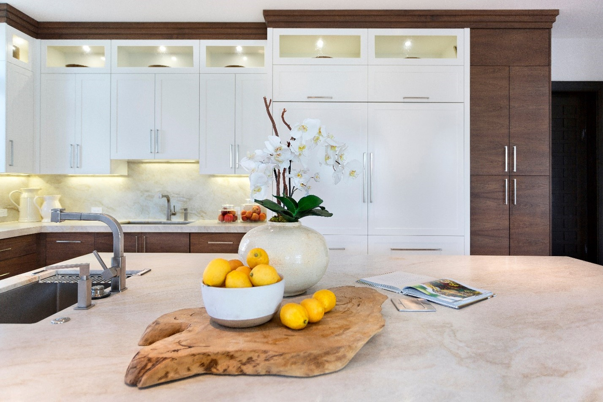
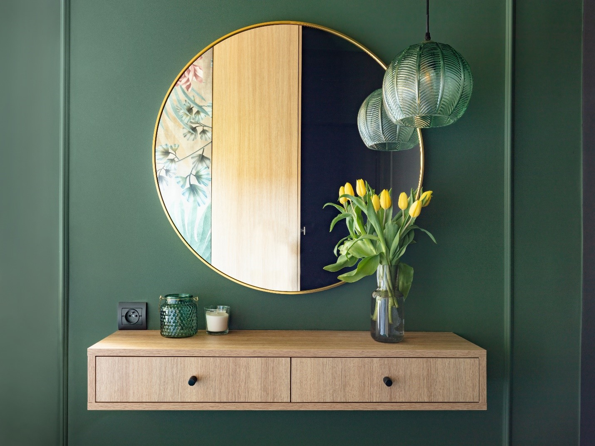
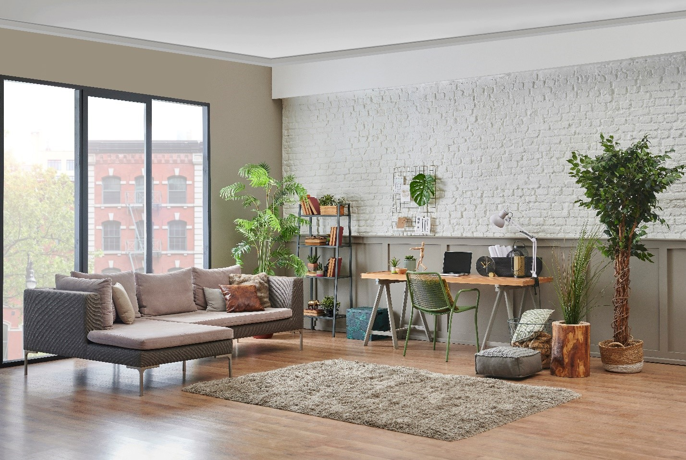

In the competitive real estate market, staging a home for sale is not just an option; it's a strategic necessity that influences a buyer's perception and decisions. Staging transforms a property from a blank canvas into a welcoming, appealing home where potential buyers can envision their future. It's more than just aesthetics; it's about creating a connection, making every room in the house speak to the possibilities of a life lived within its walls.

House staging optimizes the space by highlighting its features and minimizing flaws, enhancing the property's appeal to a broad audience. This careful curation and presentation can lead to quicker sales and, in many cases, higher offers. By allowing buyers to see the full potential of the home, staging sets the stage for success in the real estate market. The power of first impressions and the profound impact staging can have on the home-selling journey makes it a vital part of the real estate process. You can unlock your home's potential through strategic staging, making it stand out in a sea of listings. Let's explore the transformative benefits of staging your home for sale, and how it can pave the way for a smooth and successful transaction.

_Note: If you're new to real estate and wondering, "What is home staging?" It's strategically decorating and arranging a home to highlight its best features and make it more attractive to buyers._

## Benefit #1: Enhanced Appeal in Any Market

Whether the real estate market favors buyers or sellers, the appeal of a well-staged home is consistent. With meticulous furniture, decor, and lighting arrangements, staging accentuates a home and property's best features, drawing attention to the spaces that truly shine. This helps the property stand out in listings and helps potential buyers visualize the home how they want it to be. 

Home staging can elevate your property above competition in a sellers' market by capturing interest quickly. In a buyers' market, it can differentiate your home and make it memorable among many options. Ultimately, staging ensures that the appeal of your home is showcased regardless of market dynamics. You'll attract a wider audience and perhaps even see more favorable sale conditions. 

_Pro tip: If you can't be at your home physically during the sale process, try out an app for virtual home staging. These types of software can help you create a staged look based on pre-existing home photos._ 

__

## Benefit #2: Higher Sale Price Potential

**Data supports that staged homes often command a** [**higher selling price**](https://www.architecturaldigest.com/reviews/moving/home-staging-statistics) **than non-staged homes.** This can be attributed to the enhanced perceived value that staging creates. By presenting a home in its best light, staging makes more than just a space, but a lifestyle visualization for potential buyers. This strategic presentation can increase competition among interested parties, driving up the final sale price. While good staging requires a little upfront investment, it can offer substantial returns by elevating the property’s market value. For sellers aiming to maximize their profit, staging is more than just a marketing tactic; it's a critical investment in the sales process.   

## Benefit #3: Reduced Time on Market

When you're [selling your home,](https://blog.idealagent.com/thinking-of-selling-your-home-connect-with-your-ideal-agent-today/) staging does more than make it look nice; it helps potential buyers see it as their next home sweet home. This visual nudge can make all the difference, leading to quicker offers from buyers who fall in love with the place on their first visit. Imagine your home not just as a set of rooms but as a canvas where buyers can picture their future—this connection speeds up the selling process. Instead of your home sitting on the market for weeks or months, staging can help it find its new owners in no time. It's a smart move that helps your home stand out and means less waiting for you. So, in the end, staging is a win-win: your home sells faster, and you can move on to your next adventure sooner.

## Benefit #4: Stronger First Impressions

Think of the last time you walked into a home and immediately thought, "Wow, I could see myself living here!" That's the magic of a good first impression, and it's precisely what staging a home to sell can do. When buyers walk through a staged home, they're not just looking at walls and floors; they're seeing a future home, a place they can host dinner parties, relax in the living room, or enjoy a quiet morning in the breakfast nook.  

Staging sets the scene for these moments, making your home more than just a listing—it becomes a living, breathing space for your life. This powerful first impression sticks with potential buyers long after they leave, making your home the north star for other viewings. Staging your home in a memorable and inviting way leaves a lasting impression that can make a difference. 

_Related:_ [_How to Decorate a House with Plants_](https://blog.idealagent.com/how-to-decorate-a-house-with-plants/)

## Benefit #5: Emotional Connection

Just like hearing your favorite song can turn your day around, walking into a staged home can spark buyers' "this is the one" feeling. It's all about creating an emotional connection. When a house is staged, it's not just furniture and decor—it's the promise of a new chapter. Buyers can imagine cozy movie nights in the living room, laughter-filled dinners in the dining area, or peaceful mornings with coffee in the backyard.

This emotional bond is powerful; it transforms a house into a dream home in the buyer's eyes. It's about making them feel welcome, making it easy for them to say, "I could live here." That connection is what often leads to quicker sales. After all, buying a home is as much about the heart as it is about the head. Staging helps bridge that gap, turning interest into desire and desire into action. So, when you stage your home, you're not just selling a space but a future full of possibilities.

## Benefit #6: Show Your Home's Potential

A spare bedroom might seem just okay initially, but with the right touch, it suddenly becomes a cozy guest room, a home office, or a craft room. House staging pulls back the curtain, showing off how a home can adapt to fit a buyer's life. The right staging highlights the spaciousness of the living area, the warmth of the fireplace, or the perfect nook for a reading spot. This isn't just about decorating; it's about envisioning a lifestyle that buyers can't resist. (And showing them all the different lifestyles they could enjoy in the space.) When potential buyers can see themselves living their ideal lives in your home, you know staging has worked its magic, turning potential into a profitable outcome.   

## Benefit #7: Competitive Edge

A well-staged home stands out like a lighthouse in a sea of listings. It's the difference between blending in and popping off the page in online listings or during open houses. When buyers scroll through homes, they're more likely to remember the most visually appealing ones. A well-staged home can show buyers that even modest properties can meet their expectations with the right touch. 

### For Staging and Beyond

An IDEAL AGENT real estate professional can help you with the selling and staging homes — plus everything else along the way! Real estate agents know what buyers are looking for in listings. Let them take the lead when staging your home for listing — and rest easy knowing you'll maximize your profit with commissions as low as 2%. Ready to get started? [Contact us today](https://idealagent.com/sell-your-home/). 

## FAQs About Home Staging

What happens in home staging?

During the home staging process, you or your agent will decorate and arrange your home for sale in a way that’s optimally pleasing to potential buyers. It involves cleaning, interior decorating, and knowledge of trends and desirable decor.

Is it worth it to stage a home?

It’s typically worth it financially to invest in home staging. According to the National Association of Realtors, staged homes can go for up to 20% more than non-staged homes.

How do I stage my own house?

There are many ways to stage your home, depending on your style and taste! Check out our blog on [Getting Your Home Ready to Sell](https://blog.idealagent.com/5-steps-to-getting-your-home-ready-to-sell/) for home staging tips and more information. 

What is soft staging a home?

Soft staging is a simplified version of home staging. You may bring in new decor and accessories, but keep the current furniture in the home to decrease the required investment.
